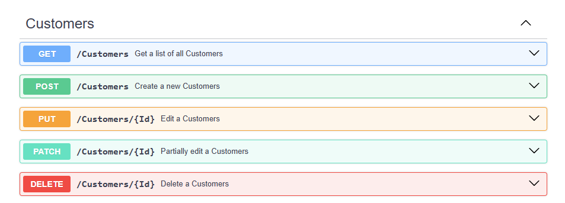
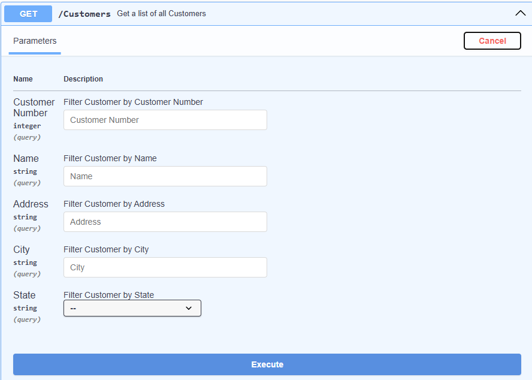

# WebApi Framework
The WebApi Framework allows you to build a REST Api in DataFlex with the help of drag and drop features within the DataFlex Studio. You can expose fields in your api similarly to how you expose data in a DataFlex application, using the entry_item command.


## Swagger UI
The WebApi Framework generates documentation for your REST Api in the format of the OpenApi specification. The OpenApi specification can then be used in tools like Swagger (https://swagger.io/) and Postman (https://www.postman.com/) to easily test your api and/or share it with a consumer of your REST api.

The library comes with a web control that you can put into your web applications. This web control turns the OpenApi specification into a readable and easy to understand user interface.

Swagger UI is capable of describing the following aspects of your REST api:

- Available endpoints.
- What format data format is supported by the server (XML/JSON).
- The data the client is expected to send along with his/her request.
- The data the client can expected in response.
- Status codes.
- Available filters (query parameters).
- What security scheme is used (BasicAuth, JWT Bearer).





## Overview
- The [Sample](Web API Sample) folder contains a sample workspace which contains a REST api built with the library.
- The [Library](Web API Library) folder contains the actual library that should be attached to your workspace.
- The WebApi folder contains the javascript files needed to render the Swagger UI component in the browser. This should be copied to your application's AppHtml folder.
- The Help folder contains a markdown file that serves as documentation for the WebApi framework.

## Usage
To use the WebApi Framework in your workspace perform the following actions:
- Attach the library to your workspace
- If you wish to use the Swagger UI web control in your application move the [WebApi](Web API Library\AppHtml\WebApi) folder to the AppHtml folder of your application.
- Add the lines below to your index.html
```
<script src="WebApi/swagger-ui-bundle"></script>
<script src="WebApi/swagger-ui-standalone-preset.js"></script>
<script src="WebApi/SwaggerDocumentation.js"></script>
<link rel="stylesheet" type="text/css" href="WebApi/swagger-ui.css">
```

Now the WebApi Framework can be used within your web application.

