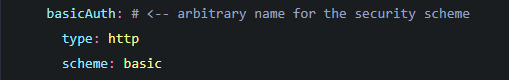
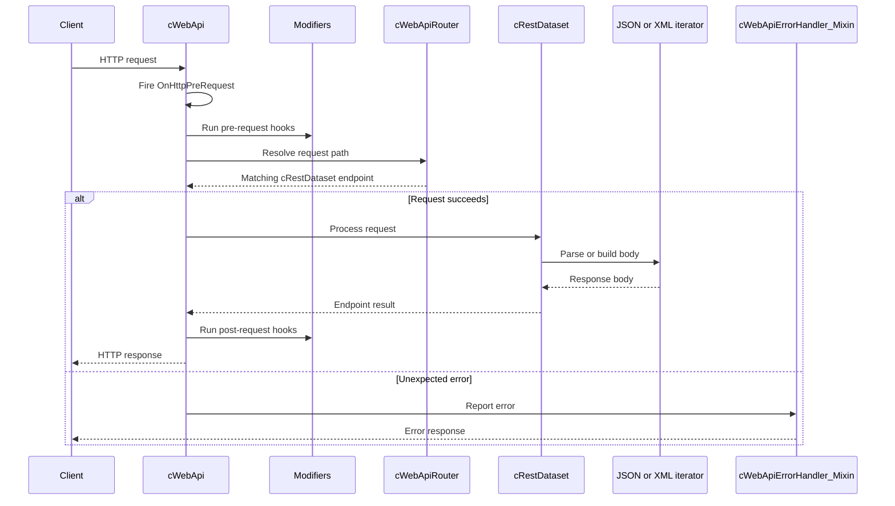
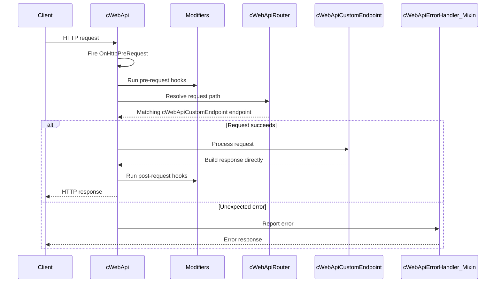

# Technical documentation - WEB API Framework

## Table of Contents

- [1 Introduction](#1-introduction)
- [2 Example usage](#2-example-usage)
  - [2.1 Building a very basic REST service](#21-building-a-very-basic-rest-service)
  - [2.2 Adding information from a parent table to a endpoint](#22-adding-information-from-a-parent-table-to-a-endpoint)
  - [2.3 Adding information from a child table to a endpoint](#23-adding-information-from-a-child-table-to-a-endpoint)
  - [2.4 How to use routers](#24-how-to-use-routers)
  - [2.5 Implementing modifiers](#25-implementing-modifiers)
  - [2.6 Implementing authentication/authorization](#26-implementing-authenticationauthorization)
    - [2.6.1 Including authentication/authorization into the OpenApi specification](#261-including-authenticationauthorization-into-the-openapi-specification)
  - [2.7 Building custom endpoints](#27-building-custom-endpoints)
- [3 Request lifecycle](#3-request-lifecycle)
  - [3.1 cRestDataset flow](#31-crestdataset-flow)
  - [3.2 cWebApiCustomEndpoint flow](#32-cwebapicustomendpoint-flow)
- [4 Components](#4-components)
  - [Which component should I use?](#which-component-should-i-use)
  - [Component overview](#component-overview)
  - [4.1 cWebApi](#41-cwebapi)
  - [4.2 cWebApiRouter](#42-cwebapirouter)
  - [4.3 cBaseRestDataset](#43-cbaserestdataset)
  - [4.4 cRestDataset](#44-crestdataset)
  - [4.5 cWebApiCustomEndpoint](#45-cwebapicustomendpoint)
  - [4.6 cWebApiLoginEndpoint](#46-cwebapiloginendpoint)
  - [4.7 cOpenApiEndpoint](#47-copenapiendpoint)
  - [4.8 cRestField](#48-crestfield)
  - [4.9 cOpenApiRestField](#49-copenapirestfield)
  - [4.10 cRestChildCollection](#410-crestchildcollection)
  - [4.11 cRestEntity](#411-crestentity)
  - [4.12 cWebApiModifier](#412-cwebapimodifier)
  - [4.13 cWebApiAuthModifier](#413-cwebapiauthmodifier)
  - [4.14 cBaseWebApiIterator](#414-cbasewebapiiterator)
  - [4.15 cJSONIterator](#415-cjsoniterator)
  - [4.16 cXMLIterator](#416-cxmliterator)
  - [4.17 cRest_Mixin](#417-crest_mixin)
  - [4.18 cWebApiModifierHost_Mixin](#418-cwebapimodifierhost_mixin)
  - [4.19 cWebApiRoutableHost_Mixin](#419-cwebapiroutablehost_mixin)
  - [4.20 cWebApiErrorHandler_Mixin](#420-cwebapierrorhandler_mixin)
  - [4.21 cOpenApiSpecification](#421-copenapispecification)
  - [4.22 cSwaggerUI](#422-cswaggerui)
- [5 HTTP operations and endpoint behavior](#5-http-operations-and-endpoint-behavior)
  - [5.1 cRestDataset operations](#51-crestdataset-operations)
  - [5.2 Fields and related records](#52-fields-and-related-records)
  - [5.3 Filtering and pagination](#53-filtering-and-pagination)
  - [5.4 cWebApiCustomEndpoint behavior](#54-cwebapicustomendpoint-behavior)
  - [5.5 Status codes and error responses](#55-status-codes-and-error-responses)
- [6 Structs, constants and enums](#6-structs-constants-and-enums)
  - [6.1 Structs](#61-structs)
    - [6.1.1 tRESTRequestBody](#611-trestrequestbody)
    - [6.1.2 tWebApiCallContext](#612-twebapicallcontext)
    - [6.1.3 tSecuredDataset](#613-tsecureddataset)
    - [6.1.4 oneOf](#614-oneof)
    - [6.1.5 tEndpointDefinition](#615-tendpointdefinition)
    - [6.1.6 tVerbDefinition](#616-tverbdefinition)
    - [6.1.7 tResponseDefinition](#617-tresponsedefinition)
    - [6.1.8 tFieldDefinition](#618-tfielddefinition)
    - [6.1.9 tParameterDefinition](#619-tparameterdefinition)
  - [6.2 Constants](#62-constants)
  - [6.3 Enums](#63-enums)
    - [6.3.1 Field types](#631-field-types)
    - [6.3.2 Parameter types](#632-parameter-types)
- [7 Troubleshooting and common mistakes](#7-troubleshooting-and-common-mistakes)
  - [7.1 Endpoint and routing problems](#71-endpoint-and-routing-problems)
  - [7.2 Empty or incomplete responses](#72-empty-or-incomplete-responses)
  - [7.3 Request body and update failures](#73-request-body-and-update-failures)
  - [7.4 Filtering and pagination problems](#74-filtering-and-pagination-problems)
  - [7.5 OpenAPI and Swagger problems](#75-openapi-and-swagger-problems)
  - [7.6 Authentication and modifier problems](#76-authentication-and-modifier-problems)
  - [7.7 Response format and iterator problems](#77-response-format-and-iterator-problems)

## 1 Introduction

This document contains all the information regarding the implementation of the technical aspects of the Web API framework.

## 2 Example usage

This chapter contains examples on how to build a REST service using the library. It explains what you need to start, how concepts like routers work, how you make your own endpoint and configure it, how you can build a login endpoint, how you can add extra functionality to your REST service using modifiers and how to enable authentication.

### 2.1 Building a very basic REST service

For this example we'll take the WebOrder workspace that is installed along with the DataFlex installation to build a very basic REST service.

To start open the WebOrder workspace in your studio. Preferably the 25.0 studio as this version comes with features that allow drag and drop to work from the DDO explorer.

In the studio toolbar click Tools -> Maintain libraries. The Library maintenance panel should now pop up. Navigate to the folder where you installed the library. Select the .sws version that matches your DataFlex version.

Now that the library is in the workspace you can start creating a REST service. The easiest way to get started is to the Web HTTP handler wizard. In the studio toolbar select File -> New -> Web Object -> Web HTTP Handler. The wizard pops up and asks for a name. For this example I'll call it oMyRestAPI. This file should now be open in the studio.

```dataflex
Use cWebHttpHandler.pkg

// With the cWebHttpHandler you handle complete HTTP requests.
Object oMyRestAPI is a cWebHttpHandler

// The psPath property determines the path in the URL for which requests will be handled.
Set psPath to "MyHandler"
// Use psVerbs to filter based on the HTTP Verbs.
Set psVerbs to "*"

End_Object
```

You can get rid of all the current code inside of the cWebHttpHandler. After this change the use statement to "Use cWebApi.pkg" and change the class of the object from cWebHttpHandler to cWebApi. Your file should now look something like this:

```dataflex
Use WebApi\cWebApi.pkg

Object oMyRestAPI is a cWebApi

End_Object
```

If you now navigate to the WebOrder url and append /Api to the url you'll send a request to this object. So for DataFlex 25.0 I would send a request to: http://localhost/WebOrder_25_0/Api . If you already have a existing WebHttpHandler that listens to /Api you can change it by setting the psPath of the cWebApi object. For example if you set the psPath to "RestLibraryService" you would need to send a request to: http://localhost/WebOrder_25_0/RestLibraryService .

You'll see that if you send a request to this REST service now you receive no response. This is because there is no content inside of our REST service.

Before we add any content we need to tell the cWebApi object what datatypes we want to support for our REST service. For example do we want JSON, XML or maybe we want both? To do this we use the AddIterator command inside of the cWebApi object. This procedure takes two parameters. The first being a reference to the class that it needs to use to build up the response in that specific data type. The second parameter is what accept-type/content-type it will be used for. Keep in mind that the first iterator you register to the cWebApi object will be the default. So if someone sends a request with a not supported accept-type or content-type it will default to the first iterator. This will look something like the following:

```dataflex
Object oMyRestAPI is a cWebApi
    Send AddIterator (RefClass(cJSONIterator)) "application/json"
    Send AddIterator (RefClass(cXMLIterator)) "application/xml"
End_Object
```

This basically means that whenever we receive a request with accept-type or content-type "application/json" we'll use the cJSONiterator class to handle this request. And the same goes for the cXMLiterator whenever we receive a request with "application/xml". And as previously mentioned, in this case the default is the cJSONIterator.

Now that the REST service knows what datatypes are supported. We can start adding our data. To make our cWebApi less cluttered we will create our endpoint in a separate file.

In the toolbar select File -> New -> Other -> DataFlex Source File. For this example I'll be calling this file "MyFirstEndpoint.pkg". For this example lets expose the inventory table in the WebOrder database.

To start import the cRestDataset class by typing "Use cRestDataset.pkg". The cRestDataset is the basis for your data aware endpoints. Now make a object of the cRestDataset class. I'll be calling it oMyEndpoint in this example. Set the psPath property of this object to Inventory. Your code should now look something like this:

```dataflex
Use WebApi\cRestDataset.pkg

Object oMyEndpoint is a cRestDataset
    Set psPath to "Inventory"
End_Object
```

Go back to the cWebApi object and add the use statement to the new file inside of it. This should look like the following:

```dataflex
Object oMyRestAPI is a cWebApi
    Send AddIterator (RefClass(cJSONIterator)) "application/json"
    Send AddIterator (RefClass(cXMLIterator)) "application/xml"

    Use MyFirstEndpoint.pkg
End_Object
```

Our endpoint is now registered in the cWebApi object. This means that if we now send a request to http://localhost/WebOrder_25_0/Api/Inventory . It will reach our endpoint. However as of right now it has no content. To change this lets add the needed data dictionaries. Inside of your endpoint open the DDO explorer, select "Add DDO" and select the cInventoryDataDictionary. Your endpoint should now look something like this:

```dataflex
Object oMyEndpoint is a cRestDataset
    Set psPath to "Inventory"

    Object oVendor_DD is a cVendorDataDictionary
    End_Object

    Object oInventory_DD is a cInventoryDataDictionary
        Set DDO_Server to oVendor_DD
    End_Object

    Set Main_DD to oInventory_DD
    Set Server to oInventory_DD

End_Object
```

If you now send a request to this endpoint you'll see that you get a bunch of empty object. This is because we have not defined the data we want to return yet. For this example lets expose the following fields from the inventory table:

- Item_ID
- Description
- Unit_Price
- On_Hand

To do this we'll use the cRestField. This is what allows you to expose your fields. The cRestField has some options you can configure. For example you can make a field ReadOnly by setting the propery pbReadOnly to true. This means that the framework will allow this field if its present in the request body for a POST, PUT or PATCH request. You can also make a field WriteOnly, this means that you can send the field to the server through a request body, but it will not be returned in the response. This is especially usually for sensitive data for password fields, or when a user makes some form of login attempt. You can filter on all defined fields by default. This can be done by adding a query parameter to your url. For example if I wanted all inventory records that have "BEARS" as their Item Id I could use the following url:

http://localhost/WebOrder_25_0/Api/Inventory?Item%20Id=BEARS . This will give me all the records where Item Id is "BEARS". You can add multiple query parameters by using "&". If you do not want the field to be filterable you can set pbFilterable to false.

By default the cRestField will have the same name as the field in your data dictionary. If you wish to give this a custom name set the psFieldName property.

If you are following this guide in DF 25 you can select the above fields in the DDO explorer and drag them inside of your endpoint. The cRestFields will automatically be created with the correct entry_item. If you are not using this library in DF 25 you will need to create these objects manually and add the correct entry_item.

After you've added these cRestFields your code should look something like the following:

```dataflex
Object oMyEndpoint is a cRestDataset
    Set psPath to "Inventory"

    Object oVendor_DD is a cVendorDataDictionary
    End_Object

    Object oInventory_DD is a cInventoryDataDictionary
        Set DDO_Server to oVendor_DD
    End_Object

    Set Main_DD to oInventory_DD
    Set Server to oInventory_DD

    Object oInventory_Item_ID is a cRestField
        Entry_Item Inventory.Item_ID
    End_Object

    Object oInventory_Description is a cRestField
        Entry_Item Inventory.Description
    End_Object

    Object oInventory_Unit_Price is a cRestField
        Entry_Item Inventory.Unit_Price
    End_Object

    Object oInventory_On_Hand is a cRestField
        Entry_Item Inventory.On_Hand
    End_Object

End_Object
```

If you now send a request to this endpoint you'll see that each object now contains the fields we have defined above. This is how you setup a very basic endpoint. This automatically enables the GET, POST, PUT, PATCH and

DELETE verbs. If you want to disable some of these you can take a look at the pbAllowRead, pbAllowCreate, pbAllowEdit and pbAllowDelete properties of the cRestDataset object.

All data dictionary operations follow the business rules defined in your data dictionary. So if there is a required field that is not exposed by your endpoint you will not be able to create new records as validation will fail.

If you've followed the steps above you now have configured your first very basic REST service. The framework will automatically create a OpenApi specification based on the endpoints you created. The OpenApi specification is a description of your REST service and can be used in tools like SwaggerUI to create a documentation page. Explanation on how to incorporate SwaggerUI into your application is explained in a later chapter.

### 2.2 Adding information from a parent table to a endpoint

cRestFields are used to expose data from a table. However if we want to add data from a external table its nice to have a visual difference between the data from the main table and the parent table. In JSON this could be a nested JSON object that has all the information related to the parent table. To get this working you'll need to use the cRestEntity class. This class lets the framework know that we're using data from a different table.

The first step would be to add a object that is a cRestEntity. Its important that you set the server of this object to the data dictionary that manages this parent table. For this example we'll add the Vendor table to the inventory endpoint. The endpoint will now look something like the following:

```dataflex
Object oMyEndpoint is a cRestDataset
    Set psPath to "Inventory"

    Object oVendor_DD is a cVendorDataDictionary
    End_Object

    Object oInventory_DD is a cInventoryDataDictionary
        Set DDO_Server to oVendor_DD
    End_Object

    Set Main_DD to oInventory_DD
    Set Server to oInventory_DD

    Object oInventory_Item_ID is a cRestField
        Entry_Item Inventory.Item_ID
    End_Object

    Object oInventory_Description is a cRestField
        Entry_Item Inventory.Description
    End_Object

    Object oInventory_Unit_Price is a cRestField
        Entry_Item Inventory.Unit_Price
    End_Object

    Object oInventory_On_Hand is a cRestField
        Entry_Item Inventory.On_Hand
    End_Object

    Object oVendorEntity is a cRestEntity
        Set Server to oVendor_DD

    End_Object

End_Object
```

If we were to send a request to this endpoint now you'll see that each record we receive also has a nested "Vendor" object that is empty. To add data to this object we can use cRestFields again, just like how we did it with the cRestDataset. For this example I'll add the following fields to the vendor entity:

- Name
- Address
- City
- State

The entity object should now look something like this:

```dataflex
    Object oVendorEntity is a cRestEntity
        Set Server to oVendor_DD

        Object oVendor_Name is a cRestField
            Entry_Item Vendor.Name
        End_Object

        Object oVendor_Address is a cRestField
            Entry_Item Vendor.Address
        End_Object

        Object oVendor_City is a cRestField
            Entry_Item Vendor.City
        End_Object

        Object oVendor_State is a cRestField
            Entry_Item Vendor.State
        End_Object

    End_Object
```

If you now send a request to the endpoint you'll see that each vendor object is filled with the defined information. By default the entity's name will be whatever your table name is. If you want to change this to something custom you can use the psNodeName property.

### 2.3 Adding information from a child table to a endpoint

cRestFields are used to expose data from the main table. However if we want to add data from a child table its nice to have a visual difference between the data in the response. In JSON this would be a nested array of objects. The framework also somehow needs to know that it needs to find multiple related records. To do this you can use the cRestChildCollection class.

For this example we'll make a endpoint that exposes the vendor table. For each vendor record we'll show all related inventory records. This is the basis we'll start with:

```dataflex
Use WebApi\cRestDataset.pkg
Use cVendorDataDictionary.dd
Use cInventoryDataDictionary.dd
Use WebApi\cRestField.pkg

Object oVendorInventory is a cRestDataset
    Set psPath to "VendorInventory"

    Object oVendor_DD is a cVendorDataDictionary
    End_Object

    Object oInventory_DD is a cInventoryDataDictionary
        Set Constrain_file to Vendor.File_number
        Set DDO_Server to oVendor_DD
    End_Object

    Set Main_DD to oVendor_DD
    Set Server to oVendor_DD

    Object oVendor_ID is a cRestField
        Entry_Item Vendor.ID
        Set pbReadOnly to True
    End_Object

    Object oVendor_Name is a cRestField
        Entry_Item Vendor.Name
    End_Object

    Object oVendor_Address is a cRestField
        Entry_Item Vendor.Address
    End_Object

    Object oVendor_City is a cRestField
        Entry_Item Vendor.City
    End_Object

    Object oVendor_State is a cRestField
        Entry_Item Vendor.State
    End_Object

End_Object
```

To add the information from a child table to this we'll make a object that is a cRestChildCollection and set its server to the inventory data dictionary. This looks like the following:

```dataflex
    Object oInventoryCollection is a cRestChildCollection
        Set Server to oInventory_DD

    End_Object
```

We can now start adding cRestFields to it to define the data. For this example we'll add the following data:

- Item_ID
- Description
- Unit_Price
- On_Hand

This should now look something like this:

```dataflex
    Object oInventoryCollection is a cRestChildCollection
        Set Server to oInventory_DD

        Object oInventory_Item_ID is a cRestField
            Entry_Item Inventory.Item_ID
        End_Object

        Object oInventory_Description is a cRestField
            Entry_Item Inventory.Description
        End_Object

        Object oInventory_Unit_Price is a cRestField
            Entry_Item Inventory.Unit_Price
        End_Object

        Object oInventory_On_Hand is a cRestField
            Entry_Item Inventory.On_Hand
        End_Object

    End_Object
```

If you now send a request to http://localhost/WebOrder_25_0/Api/VendorInventory . You'll see that you now get all the related inventory records along with the vendor information. By default it will take the table name. However if you wish to change this you can set the psNodeName property.

### 2.4 How to use routers

Objects of the cWebApiRouter class are a extra step in the routing functionality of the framework. This class can be especially useful when you want to add something like versioning to your API or if you want a cWebApiModifier/cWebApiAuthModifier (what these are is explained in a later chapter) to only work for a select few endpoints.

To define a router you create a object of the cWebApiRouter class. A router only has two properties. The one that is relevant for this guide is the psPath property. The pbInheritSecurity proberty will be explained in the chapter about cWebApiAuthModifiers.

You can define endpoints inside of a router just like how you can define them in the cWebApi object. Endpoints defined inside of a cWebApiRouter have the psPath of the router appended to a url. Take this REST service for example:

```dataflex
Object oMyRestAPI is a cWebApi
    Send AddIterator (RefClass(cJSONIterator)) "application/json"
    Send AddIterator (RefClass(cXMLIterator)) "application/xml"

    Object oMyRouter is a cWebApiRouter
        Set psPath to "v1"

    End_Object

    Use MyFirstEndpoint.pkg
    Use VendorInventory.pkg
End_Object
```

Right now if I want to reach the endpoint we created in the very basic REST service guide I would need to send a request to http://localhost/WebOrder_25_0/Api/Inventory. However if I put the endpoint inside of the router like this:

```dataflex
Object oMyRestAPI is a cWebApi
    Send AddIterator (RefClass(cJSONIterator)) "application/json"
    Send AddIterator (RefClass(cXMLIterator)) "application/xml"

    Object oMyRouter is a cWebApiRouter
        Set psPath to "v1"

        Use MyFirstEndpoint.pkg
    End_Object

    Use VendorInventory.pkg
End_Object
```

It would be reachable at: http://localhost/WebOrder_25_0/Api/v1/Inventory. This technique can be useful if you want multiple versions of the same endpoint.

It is also possible to define cWebApiModifiers and cWebApiAuthModifiers inside of these routers. This way the modifiers functionality only applies to requests that pass through that specific router. This allows you to for example, only apply authentication for a certain set of endpoints.

It is also possible to nest routers inside of eachother. This can be useful if you have a set of public and private routers. This could look something like the following:

```dataflex
Object oMyRestAPI is a cWebApi
    Send AddIterator (RefClass(cJSONIterator)) "application/json"
    Send AddIterator (RefClass(cXMLIterator)) "application/xml"

    Object oMyRouter is a cWebApiRouter
        Set psPath to "v1"

        Object oPrivateRouter is a cWebApiRouter
            Set psPath to "private"

            Use MyFirstEndpoint.pkg
        End_Object

        Object oPublicRouter is a cWebApiRouter
            Set psPath to "public"
        End_Object

    End_Object

    Use VendorInventory.pkg
End_Object
```

The endpoint is now reachable at http://localhost/WebOrder_25_0/Api/v1/private/Inventory.

### 2.5 Implementing modifiers

Modifiers are extra features you want to add to your REST service such as logging. You build a modifier by using the cWebApiModifier class. There are types of modifiers. The one this chapter focuses on is the cWebApiModifier object, this class is meant for implementing features such as logging. The second type is the cWebApiAuthModifier which enables you to implement authentication/authorization. That class will be explained in the next chapter.

The cWebApiModifier has two types of events. The first being the OnPreRequest event and the second being the OnPostRequest event. Both of these events get a webapicallcontext passed as a parameter. This webapicallcontext struct is filled with information related to the current request.

The framework will first determine what endpoint the call is being send to. The framework will remember all the modifiers defined inside of the cWebApi, cWebApiRouter and endpoint classes that it needed to navigate to the endpoint.

After this, right before the framework starts formulating a response to the client it will call the OnPreRequest event of all the modifiers that it found for the current request. For a logging object this is a good place to log information such as:

- The verb used in the current request
- The time the request was received
- The path of the endpoint

Most of this information can be found inside of the webapicallcontext struct.

Right before the message is returned to the client the OnPostRequest event is called. For a logging class this is a good place to find information such as:

- The time it needed to handle the request
- The status code of the request

Finally you can save the information to some table or maybe just write it to a file. The following example logging class is also included in the example workspace:

```dataflex
Object oRequestLogger is a cWebApiModifier

    Object oApiLogs_DD is a cApiLogsDataDictionary
    End_Object

    //Logs the incoming request time
    Procedure OnPreRequest tWebApiCallContext  ByRef webapicallcontext
        String sIncomingTime

        Send Clear of oApiLogs_DD

        Move (CurrentDateTime()) to sIncomingTime

        Set Field_Changed_Value of oApiLogs_DD Field ApiLogs.Verb to webapicallcontext.sVerb
        Set Field_Changed_Value of oApiLogs_DD Field ApiLogs.TimeReceived to sIncomingTime
        Set Field_Changed_Value of oApiLogs_DD Field ApiLogs.Endpoint to webapicallcontext.sPath
    End_Procedure

    //Logs outgoing request time, status code and saves the record
    Procedure OnPostRequest tWebApiCallContext  ByRef webapicallcontext
        Boolean bErr
        String sResponseTime

        Move (CurrentDateTime()) to sResponseTime

        Set Field_Changed_Value of oApiLogs_DD Field ApiLogs.TimeResponse to sResponseTime
        Set Field_Changed_Value of oApiLogs_DD Field ApiLogs.StatusCode to webapicallcontext.iStatusCode

        Get Request_Validate of oApiLogs_DD to bErr

        If (not(bErr)) Begin
            Send Request_Save of oApiLogs_DD
        End
    End_Procedure

End_Object
```

### 2.6 Implementing authentication/authorization

Authentication can be built into the framework using the cWebApiAuthModifier class. This class has three events that you can augment. Those being the OnPreRequest, OnPostRequest and OnAuth events. The OnPreRequest and OnPostRequest are not that important for the cWebApiAuthModifier but they are there if you wish to use them. If you do wish to augment the OnPreRequest make sure you do a forward send or the main functionality of this class will not work.

The most important part of this class is the OnAuth event. This event is fired whenever this modifier is part of the current request and the endpoint used in the call is secured by this cWebApiAuthModifier.

By default the cWebApiAuthModifier secures all endpoints defined on the same level as this modifier and each endpoint defined on a lower level. For example if a cWebApiAuthModifier is defined directly inside of the cWebApi object like so:

```dataflex
Object oMyRestAPI is a cWebApi
    Send AddIterator (RefClass(cJSONIterator)) "application/json"
    Send AddIterator (RefClass(cXMLIterator)) "application/xml"
    Object oMyAuthModifier is a cWebApiAuthModifier
    End_Object
    Object oMyRouter is a cWebApiRouter
        Set psPath to "v1"
        Use MyFirstEndpoint.pkg
    End_Object
    Use VendorInventory.pkg
End_Object
```

In this example the OnAuth event will be called when a request is sent to either the endpoint defined in MyFirstEndpoint.pkg or the one defined in VendorInventory.pkg. However you were to place the oMyAuthModifier object inside of the oMyRouter object like so:

```dataflex
Object oMyRestAPI is a cWebApi
    Send AddIterator (RefClass(cJSONIterator)) "application/json"
    Send AddIterator (RefClass(cXMLIterator)) "application/xml"

    Object oMyRouter is a cWebApiRouter
        Set psPath to "v1"

        Object oMyAuthModifier is a cWebApiAuthModifier
        End_Object

        Use MyFirstEndpoint.pkg
    End_Object

    Use VendorInventory.pkg
End_Object
```

The OnAuth event will only be called when a request is being sent to the endpoint defined inside of "MyFirstEndpoint.pkg". Both the dataset classes and the cWebApiRouter classes have a property called pbInheritSecurity. Whenever this is set to false it will not use the cWebApiAuthModifiers defined on a higher level. If you take the first example where the oMyAuthModifier object is defined inside of the cWebApi object, if you were to set pbInheritSecurity of the oMyRouter object like so:

```dataflex
Object oMyRestAPI is a cWebApi
    Send AddIterator (RefClass(cJSONIterator)) "application/json"
    Send AddIterator (RefClass(cXMLIterator)) "application/xml"

    Object oMyAuthModifier is a cWebApiAuthModifier
    End_Object

    Object oMyRouter is a cWebApiRouter
        Set psPath to "v1"
        Set pbInheritSecurity to False

        Use MyFirstEndpoint.pkg
    End_Object

    Use VendorInventory.pkg
End_Object
```

The OnAuth event of the oMyAuthModifier object will not be fired when a request is being sent towards any endpoint defined inside of the oMyRouter object. This allows you more control over what endpoints you really want to secure.

The OnAuth event has a single parameter, this is the webapicallcontext struct. This is a important parameter that allows us to define if the current request should have access to our current resource.

The webapicallcontext struct has a bunch of members. The members that are most important for this event are the following members:

- bErr
- iStatusCode
- sShortStatusMessage
- sErrorMessage

Whenever bErr is set to true the framework will know that it should not proceed with the current request and will attempt to build up a error response to the client. It will do so using the iStatusCode, sShortStatusMessage and sErrorMessage.

The message will be formatted according to the following RFC: https://www.rfc-editor.org/rfc/rfc9457.html

iStatusCode defines the status code returned, sShortStatusMessage is the text that accompanies the status code, for a 403 this would be "forbidden" for example. And sErrorMessage can be a longer custom string to return a more detailed error explanation.

So you can perform any logic you want in terms of authentication, when the condition you set is not met you set bErr to true and configure the other members and the framework will handle the rest automatically. The sample workspace has a few example authentication/authorization mechanisms. The most basic one is the BasicAuth authentication mechanism which sends a base64 encoded username and password in the Authorization header of the request.

#### 2.6.1 Including authentication/authorization into the OpenApi specification

In order to reflect your authentication/authorization mechanism into the OpenApi specification two steps should be taken.

The first step that should be taken is to set the property psSecuritySchemaName to the name of your security schema. You can find these names on the following page: https://swagger.io/docs/specification/v3_0/authentication/

So for example if you were to implement username and password authentication using BasicAuth you would set the psSecuritySchemaName to basicAuth.

The second step is to augment the OnDefineAuthSchema event. This event has one parameter which is called vSecurityStruct. You should move a struct inside of this variant that matches the schema described in the swagger documentation. For basicAuth the schema looks like the following:

We already defined basicAuth as the psSecuritySchemaName. So all that is left is to create a struct that has the following two members:

- Type
- Scheme

The value of type should be http and the value of scheme should be basic. Our code would look something like the following:

```dataflex
Struct basicAuth
    String type
    String scheme
End_Struct

Procedure OnDefineAuthRules Variant  ByRef vSecurityStruct
    basicAuth basicauth

    Forward Send OnDefineAuthRules (&vSecurityStruct)

    Move "http" to basicauth.type
    Move "basic" to basicauth.scheme

    Move basicauth to vSecurityStruct
End_Procedure
```

The OpenApi specification should now properly reflect the authentication/authorization mechanism.



### 2.7 Building custom endpoints

The cRestDataset aims to streamline creating a REST api but that also means it does a lot for you in the background. These are things you can't easily change or write your own implementation for. For example, you might want to implement your own set of status codes, within the cRestDataset this is not currently possible.

If you wish to have a more custom implementation but still retain the possibility of generating the OpenApi specification you can use the cWebApiCustomEndpoint class. This class works similarly to the old

**cWebHttphandler**

(https://docs.dataaccess.com/dataflexhelp/mergedprojects/VDFClassRef/cWebHttpHandler.htm) .

Which means the developer is responsible for implementing the OnHttpGet, OnHttpPost, OnHttpPut, OnHttpPatch and OnHttpDelete events.

In order for the endpoint to be included in the OpenApi specification it is necessary to implement the OnDefineSchema event. This event comes with the endpointDefinition parameter. This struct needs to be filled in order for your endpoint to be reflected in the OpenApi specification.

For example, if you made a endpoint that exposes the GET and POST verbs, the GET verb retrieves the avatar of a person and the POST verb uploads a avatar of a person it could look something like this:

```dataflex
    Procedure OnDefineSchema tEndpointDefinition  ByRef endpointDefinition
        tFieldDefinition imageField
        tVerbDefinition genericVerbInformation getVerb postVerb
        tParameterDefinition personIDParam

        //Configure the Image field
        Move "image" to imageField.sFieldName
        Move WEBAPI_BINARY_FIELD to imageField.eFieldType
        Move True to imageField.bRequired

        Move "ID" to personIDParam.sName
        Move "ID of the person" to personIDParam.sDescription
        Move WEBAPI_QUERY_PARAMETER to personIDParam.eParameterIn
        Move WEBAPI_INTEGER_FIELD to personIDParam.eParameterType
        Move True to personIDParam.bRequired

        Move personIDParam to genericVerbInformation.parameters[-1]

        //Configure the response data
        Move imageField to genericVerbInformation.responses[0].responseFields[-1]
        Move C_WEBAPI_OK to genericVerbInformation.responses[0].iStatusCode
        Move "OK" to genericVerbInformation.responses[0].sStatusCodeDescription
        Move "application/octet-stream" to genericVerbInformation.responses[0].asResponseMediaTypes[-1]

        //Move the shared info to the seperate structs
        Move genericVerbInformation to getVerb
        Move genericVerbInformation to postVerb

        //Define the image field as a requested field
        Move imageField to postVerb.requestFields[0]
```

The first step is to define a few structs. These do the following:

**imageField**

This struct defines that image field that we we expect from the client. This consists of a name, the type of the field and we can mark the field as required or not.

**genericVerbInformation**

Inside of this struct we put the information that is shared between both the GET and POST verbs. That includes information such as the response format as they both return a avatar.

**getVerb**

This struct contains the information needed to describe the GET verb.

**postVerb**

This struct contains the information needed to describe the POST verb. This only slightly differs from the getVerb. The main differences are the description, the actual verb and the expected request body.

**personIDParam**

This struct contains the information needed to describe the person id query parameter.

Next we start filling the structs with the needed information. The first thing we configure is the imageField struct. We give it the name "image" and mark it as a binary field. This is needed so the OpenApi specification understands it needs to use the file dialog. We also mark it as a required field.

Next we configure the person id parameter. First we set its name to "ID" and give it a short description. We mark it as a query parameter so that swagger knows this is a query parameter and not a path parameter. We mark the field type as integer and finally we mark it as a required field.

Next we configure the response format for both the verbs. We use the imageField struct we defined earlier as a response. You can define multiple responses for a single verb but for this example we'll stick to a singular response. If you wanted to create an additional response it is as simple as just using a different index in the genericVerbInformation.responses array. After we do this we add the status code 200 to the response. At last we mark "application/octet-stream" as the media type for the response.

Next we configure the differences between the GET and POST verbs. The main differences are in the actual verb and the description.

Aside from that the POST verb gets an additional expected request field from the client which is the image field. We also tell the POST verb that it can accept the "application/octet-stream" and "image/jpg" media types.

Finally we move the verbs we have defined into the endpointDefinition struct.

## 3 Request lifecycle

The framework processes requests through a predictable sequence. Both paths share request preparation, routing, modifier hooks, and error handling, but they differ in how the response is created.

### 3.1 cRestDataset flow

This path is used for data-dictionary-backed endpoints. The iterator parses incoming request bodies and formats outgoing response bodies.



### 3.2 cWebApiCustomEndpoint flow

This path is used when an endpoint needs behavior that cannot be handled by the default cRestDataset. The custom endpoint builds its response directly and does not use a JSON or XML iterator.



The lifecycle consists of these stages:

1. The client sends an HTTP request to [cWebApi](#41-cwebapi).
2. cWebApi starts request processing, fires OnHttpPreRequest, and runs pre-request modifier hooks.
3. [cWebApiRouter](#42-cwebapirouter) or another routable object resolves the request path and selects an endpoint.
4. The endpoint processes the request:
   - [cRestDataset](#44-crestdataset) uses [cJSONIterator](#415-cjsoniterator) or [cXMLIterator](#416-cxmliterator) to parse request bodies and build responses.
   - [cWebApiCustomEndpoint](#45-cwebapicustomendpoint) handles its response logic directly and does not use iterators.
5. Post-request modifier hooks run before cWebApi sends the response.
6. Unexpected errors are reported through [cWebApiErrorHandler_Mixin](#420-cwebapierrorhandler_mixin), which formats the error response.

## 4 Components

This chapter explains per component what its functionality is inside of the system and in what way it communicates to other classes. Each subchapter will start with a short functional explanation of the class. Followed by a table with various properties and procedures that go into deeper technical detail about the class.

The `Inherited from` column identifies members inherited from library-native classes or mixins. It is blank for members declared by the current class. Members marked private in the source are intentionally excluded, as are DataFlex framework base-class members.

### Which component should I use?

Use this guide as a starting point when deciding which framework class to use.

| I need to... | Start with... | Notes |
| --- | --- | --- |
| Create the root API object | [cWebApi](#41-cwebapi) | Receives HTTP requests and coordinates routing, modifiers, iterators, and responses. |
| Group endpoints or create API versions | [cWebApiRouter](#42-cwebapirouter) | Routes requests to nested routers and endpoints. |
| Expose database records with standard REST behavior | [cRestDataset](#44-crestdataset) | The default choice for data-dictionary-backed CRUD endpoints. |
| Create a specialized dataset endpoint base class | [cBaseRestDataset](#43-cbaserestdataset) | Abstract base class intended for subclassing. |
| Add behavior that the default dataset cannot handle | [cWebApiCustomEndpoint](#45-cwebapicustomendpoint) | Handles custom response logic directly and does not use JSON or XML iterators. |
| Add login or registration | [cWebApiLoginEndpoint](#46-cwebapiloginendpoint) | Provides the standard session-manager login flow. |
| Expose an individual field | [cRestField](#48-crestfield) | Can be nested in [cRestDataset](#44-crestdataset), [cRestEntity](#411-crestentity), and [cRestChildCollection](#410-crestchildcollection). |
| Include related parent-table data | [cRestEntity](#411-crestentity) | Exposes related parent records as nested data. |
| Include related child-table data | [cRestChildCollection](#410-crestchildcollection) | Exposes related child records as a nested collection. |
| Use JSON with a dataset endpoint | [cJSONIterator](#415-cjsoniterator) | Used with [cRestDataset](#44-crestdataset); custom endpoints do not use this iterator. |
| Use XML with a dataset endpoint | [cXMLIterator](#416-cxmliterator) | Used with [cRestDataset](#44-crestdataset); custom endpoints do not use this iterator. |
| Add reusable request or response behavior | [cWebApiModifier](#412-cwebapimodifier) | Use [cWebApiAuthModifier](#413-cwebapiauthmodifier) when the behavior is authentication or authorization. |
| Expose the OpenAPI specification | [cOpenApiEndpoint](#47-copenapiendpoint) | Included in [cWebApi](#41-cwebapi) by default. |
| Render interactive API documentation | [cSwaggerUI](#422-cswaggerui) | Displays the specification served by [cOpenApiEndpoint](#47-copenapiendpoint). |
| Customize OpenAPI generation | [cOpenApiSpecification](#421-copenapispecification) | Intended for framework-level OpenAPI customization. |

### Component overview

The components below are grouped by the role they play in the framework. Start with the core API and routing classes, then choose the endpoint, field, iterator, modifier, or OpenAPI components that fit your use case.

**Core API and routing**

- [cWebApi](#41-cwebapi) — Root HTTP API object that receives and routes requests.
- [cWebApiRouter](#42-cwebapirouter) — Routes requests to nested routers and endpoints.

**REST endpoints**

- [cBaseRestDataset](#43-cbaserestdataset) — Abstract base class for dataset-like endpoints.
- [cRestDataset](#44-crestdataset) — Exposes data-dictionary-backed records.
- [cWebApiCustomEndpoint](#45-cwebapicustomendpoint) — Supports endpoint behavior beyond the default [cRestDataset](#44-crestdataset).
- [cWebApiLoginEndpoint](#46-cwebapiloginendpoint) — Provides login and registration behavior.
- [cOpenApiEndpoint](#47-copenapiendpoint) — Serves the generated OpenAPI specification.

**Fields and relationships**

- [cRestField](#48-crestfield) — Exposes an individual database or calculated field.
- [cOpenApiRestField](#49-copenapirestfield) — Supplies OpenAPI metadata for a custom field.
- [cRestChildCollection](#410-crestchildcollection) — Exposes related child records.
- [cRestEntity](#411-crestentity) — Exposes related parent-table data.

**Request and response formats**

- [cBaseWebApiIterator](#414-cbasewebapiiterator) — Base contract for serializing and parsing data.
- [cJSONIterator](#415-cjsoniterator) — Handles JSON request and response bodies.
- [cXMLIterator](#416-cxmliterator) — Handles XML request and response bodies.

**Modifiers**

- [cWebApiModifier](#412-cwebapimodifier) — Adds reusable request and response hooks.
- [cWebApiAuthModifier](#413-cwebapiauthmodifier) — Applies authentication and authorization rules.

**Framework mixins**

- [cRest_Mixin](#417-crest_mixin) — Adds shared path and server behavior.
- [cWebApiModifierHost_Mixin](#418-cwebapimodifierhost_mixin) — Provides modifier-host behavior.
- [cWebApiRoutableHost_Mixin](#419-cwebapiroutablehost_mixin) — Provides nested routable behavior.
- [cWebApiErrorHandler_Mixin](#420-cwebapierrorhandler_mixin) — Handles unexpected API errors.

**OpenAPI and user interface**

- [cOpenApiSpecification](#421-copenapispecification) — Builds the OpenAPI JSON document.
- [cSwaggerUI](#422-cswaggerui) — Renders an interactive Swagger UI.

### 4.1 cWebApi

**Purpose:** Top-level HTTP API entry point that routes requests and coordinates security, events, iterators, and responses.

**Use when:** Defining the root API object that receives HTTP requests.

**Extends:** `cWebHttpHandler`, [cWebApiModifierHost_Mixin](#418-cwebapimodifierhost_mixin), [cWebApiRoutableHost_Mixin](#419-cwebapiroutablehost_mixin), [cWebApiErrorHandler_Mixin](#420-cwebapierrorhandler_mixin)

**See also:** [cWebApiRouter](#42-cwebapirouter), [cRestDataset](#44-crestdataset), [cWebApiModifier](#412-cwebapimodifier)

**Overview:**

This class acts as the casing of the REST framework. This class extends from the cWebHttpHandler and is the class that will initially receive the http request. It forwards it by pulling apart the request path and forwarding it to a router with the path that is extracted from the URL.

The router will return a handle to the appropriate cRestDataset that should be used based on the current request. The cWebApi determines what iterator should be used for the current request, it passes this iterator to the cRestDataset class to build up a response. This class exposes a PreRequest and PostRequest event that developers can use to add functionality that should be fired before and after the event is handled.

If a cWebApiModifier is defined on this level it will be used on all incoming requests unless child objects opt out of inheriting the modifiers through the pbInheritSecurity property.

#### Usage example

Define one root object, register supported response formats, and include endpoints as child objects or package files:

```dataflex
Use WebApi\cWebApi.pkg

Object oMyRestAPI is a cWebApi
    Set psPath to "Api"
    Send AddIterator (RefClass(cJSONIterator)) "application/json"

    Use CustomerEndpoint.pkg
End_Object
```

For complete setup, see [Building a very basic REST service](#21-building-a-very-basic-rest-service).

#### Properties

| Property | Type | Description | Inherited from |
| --- | --- | --- | --- |
| psApiTitle | String | Property used to generate a title in the OpenApi specification. |  |
| psApiDescription | String | Property used to generate a description in the OpenApi specification. |  |
| psApiVersion | String | Property used to determine the version of the api. Will be used when generating the OpenApi specification. |  |
| psApiRoot | String | Root path used when generating server URLs in the OpenAPI specification. |  |
| pbInheritSecurity | Boolean | Property that determines if a object will inherit the auth modifiers of its parent. | [cWebApiModifierHost_Mixin](#418-cwebapimodifierhost_mixin) |
| phoRoutables | Handle[] | Handle to all the child routables. | [cWebApiRoutableHost_Mixin](#419-cwebapiroutablehost_mixin) |
| pasRoutables | String[] | Names of all the child routables. When searching for a routable we first search the string array if it exists. | [cWebApiRoutableHost_Mixin](#419-cwebapiroutablehost_mixin) |
| pbDebugMode | Boolean | Determines how error messages are returned to the client. When running in pbDebugMode the entire callstack is returned to the client. When pbDebugMode is false the message "Something went wrong on the server" is returned. | [cWebApiErrorHandler_Mixin](#420-cwebapierrorhandler_mixin) |


#### Procedures/Functions

| Procedure/Function | Description | Return type | Inherited from |
| --- | --- | --- | --- |
| AddIterator | This procedure allows developers to register an iterator the the API. Params:<br>- Integer iRefClass: The refclass of the iterator. Will later be used to create an instance of the router at runtime.<br>- String sMessageType: The message type of the iterator (like application/json). |  |  |
| OnHttpPreRequest | Event that is called before the main functionality of the framework is performed. |  |  |
| OnHttpPostRequest | Event that is called after the main functionality of the framework is performed. |  |  |
| Construct_Object | Framework lifecycle procedure called during object construction. Do not call directly. |  |  |
| OnHttpRequest | Receives and routes an HTTP request through the framework. |  |  |
| End_Construct_Object | Completes framework initialization after construction. Do not call directly. |  |  |
| Define_cWebApiModifierHost_Mixin | Initializes this mixin during framework object construction. Do not call directly. |  | [cWebApiModifierHost_Mixin](#418-cwebapimodifierhost_mixin) |
| End_Construct_cWebApiModifierHost_Mixin | If there are no modifiers on the current object just return |  | [cWebApiModifierHost_Mixin](#418-cwebapimodifierhost_mixin) |
| Define_cWebApiRoutableHost_Mixin | Initializes this mixin during framework object construction. Do not call directly. |  | [cWebApiRoutableHost_Mixin](#419-cwebapiroutablehost_mixin) |
| RoutableIndex | This procedure binary searches the pasRoutables array to see if the current object has a routable that matches the sPath. If found returns the index. If nothing is found it will return -1. Params:<br>- String sPath: The request URL. | Integer | [cWebApiRoutableHost_Mixin](#419-cwebapiroutablehost_mixin) |
| Define_cWebApiErrorHandler_Mixin | Initializes this mixin during framework object construction. Do not call directly. |  | [cWebApiErrorHandler_Mixin](#420-cwebapierrorhandler_mixin) |
| Error_Report | This procedure is called by the error handler whenever a error occurs. Writes the callstack to pasErrorCallStack when pbDebugMode is true. Params:<br>- Integer ErrNum: The number of the error.<br>- Integer Err_Line: The line on which the error occurred.<br>- String sErrMsg: The actual error message. |  | [cWebApiErrorHandler_Mixin](#420-cwebapierrorhandler_mixin) |
| StartErrorTracking | This procedure allows the cWebApi object to register itself as the error object during the current request. |  | [cWebApiErrorHandler_Mixin](#420-cwebapierrorhandler_mixin) |
| StopErrorTracking | This procedure makes the ghoErrorHandler the error object again and resets all variables to their default values. |  | [cWebApiErrorHandler_Mixin](#420-cwebapierrorhandler_mixin) |
| HttpErrorMessage | This function gets the correct error message based on what mode the error handler is running in. In pbDebugMode this will return the entire callstack. When not running in pbDebugMode this returns "Something went wrong on the server" | String | [cWebApiErrorHandler_Mixin](#420-cwebapierrorhandler_mixin) |
| DetailedErrorMessage | Helper function that combines pasErrorCallstack into a singular string that can be returned to the client. | String | [cWebApiErrorHandler_Mixin](#420-cwebapierrorhandler_mixin) |

### 4.2 cWebApiRouter

**Purpose:** Routes requests to nested routers and endpoints, including versioned API paths.

**Use when:** Grouping endpoints or creating separate API route versions.

**Extends:** `cObject`, [cRest_Mixin](#417-crest_mixin), [cWebApiModifierHost_Mixin](#418-cwebapimodifierhost_mixin), [cWebApiRoutableHost_Mixin](#419-cwebapiroutablehost_mixin)

**See also:** [cWebApi](#41-cwebapi), [cRestDataset](#44-crestdataset), [cWebApiRoutableHost_Mixin](#419-cwebapiroutablehost_mixin)

**Overview:**

This class acts as a router within the framework. This class allows a developer to build in features such as versioning within their REST api. This could be done by having multiple cWebApiRouters within a cWebApi. Each router would have its own version like v1 and v2 and so on simply by setting a path property. The cWebApi can use this path and compare it to the path of the incoming request.

A cWebApiRouter can have nested routers. This allows for example a v1 router to have a public and private sub router. A developer can create as many nested routers as they want. The RouteRequest procedure in this class will recursively route requests to child routers until it no longer has a child router. This class forwards the request by looking at the path and then compares that to the path of its children. When it finds a matching one it forwards the request. This will be done until the request reaches a cRestDataset. At that point the router returns a handle of the cRestDataset to the cWebApi so it can start building up the response. If a cWebApiModifier is defined in this layer it will only be applicable for cRestDatasets defined within this cWebApiRouter and other child routers.

#### Usage example

Place a router inside `cWebApi` to group endpoints or add a version prefix:

```dataflex
Object oV1Router is a cWebApiRouter
    Set psPath to "v1"

    Use CustomerEndpoint.pkg
End_Object
```

Child endpoints now include `v1` in their route. See [How to use routers](#24-how-to-use-routers) for nested router examples.

#### Properties

| Property | Type | Description | Inherited from |
| --- | --- | --- | --- |
| psPath | String | Part of the path in the URL. | [cRest_Mixin](#417-crest_mixin) |
| pbInheritSecurity | Boolean | Property that determines if a object will inherit the auth modifiers of its parent. | [cWebApiModifierHost_Mixin](#418-cwebapimodifierhost_mixin) |
| phoRoutables | Handle[] | Handle to all the child routables. | [cWebApiRoutableHost_Mixin](#419-cwebapiroutablehost_mixin) |
| pasRoutables | String[] | Names of all the child routables. When searching for a routable we first search the string array if it exists. | [cWebApiRoutableHost_Mixin](#419-cwebapiroutablehost_mixin) |


#### Procedures/Functions

| Procedure/Function | Description | Return type | Inherited from |
| --- | --- | --- | --- |
| Construct_Object | Framework lifecycle procedure called during object construction. Do not call directly. |  |  |
| End_Construct_Object | Completes framework initialization after construction. Do not call directly. |  |  |
| Define_cRest_Mixin | Initializes this mixin during framework object construction. Do not call directly. |  | [cRest_Mixin](#417-crest_mixin) |
| Define_cWebApiModifierHost_Mixin | Initializes this mixin during framework object construction. Do not call directly. |  | [cWebApiModifierHost_Mixin](#418-cwebapimodifierhost_mixin) |
| End_Construct_cWebApiModifierHost_Mixin | If there are no modifiers on the current object just return |  | [cWebApiModifierHost_Mixin](#418-cwebapimodifierhost_mixin) |
| Define_cWebApiRoutableHost_Mixin | Initializes this mixin during framework object construction. Do not call directly. |  | [cWebApiRoutableHost_Mixin](#419-cwebapiroutablehost_mixin) |
| RoutableIndex | This procedure binary searches the pasRoutables array to see if the current object has a routable that matches the sPath. If found returns the index. If nothing is found it will return -1. Params:<br>- String sPath: The request URL. | Integer | [cWebApiRoutableHost_Mixin](#419-cwebapiroutablehost_mixin) |

### 4.3 cBaseRestDataset

**Purpose:** Abstract base endpoint implementation for HTTP verbs, endpoint configuration, security, and response generation. It is intended to be subclassed rather than instantiated directly.

**Use when:** Creating a concrete dataset or specialized endpoint base class. Use `cRestDataset` or another concrete subclass for normal endpoints.

**Extends:** `cWebComponent`, [cRest_Mixin](#417-crest_mixin), [cWebApiModifierHost_Mixin](#418-cwebapimodifierhost_mixin)

**See also:** [cRestDataset](#44-crestdataset), [cWebApiCustomEndpoint](#45-cwebapicustomendpoint), [cWebApiLoginEndpoint](#46-cwebapiloginendpoint), [cOpenApiEndpoint](#47-copenapiendpoint)

**Overview:**

This class defines the data that will be exposed within a REST api. This class has all the base functionality needed for building a dataset.

#### Properties

| Property | Type | Description | Inherited from |
| --- | --- | --- | --- |
| pbReadOnly | Boolean | Determines if a dataset is read only and should only allow GET operations. |  |
| pbAllowRead | Boolean | Determines if a dataset allows GET requests. |  |
| pbAllowCreate | Boolean | Determines if a dataset allows POST requests. |  |
| pbAllowEdit | Boolean | Determines if a dataset allows PUT and PATCH requests. |  |
| pbAllowDelete | Boolean | Determines if a dataset allows DELETE requests. |  |
| pbSecureRead | Boolean | Property that determines if auth modifiers should act on GET requests to this endpoint. |  |
| pbSecureCreate | Boolean | Property that determines if auth modifiers should act on POST requests to this endpoint. |  |
| pbSecureEdit | Boolean | Property that determines if auth modifiers should act on PUT/PATCH requests to this endpoint. |  |
| pbSecureDelete | Boolean | Property that determines if auth modifiers should act on DELETE requests to this endpoint. |  |
| pbIgnoreID | Boolean | When true, GET requests are routed to OnHttpGet instead of OnHttpGetByID. |  |
| pbGenerateDocumentation | Boolean | When false, this endpoint is omitted from the generated OpenAPI documentation. |  |
| psPath | String | Part of the path in the URL. | [cRest_Mixin](#417-crest_mixin) |
| pbInheritSecurity | Boolean | Property that determines if a object will inherit the auth modifiers of its parent. | [cWebApiModifierHost_Mixin](#418-cwebapimodifierhost_mixin) |


#### Procedures/Functions

| Procedure/Function | Description | Return type | Inherited from |
| --- | --- | --- | --- |
| OnHttpGet | This procedure is called when a GET request is send to the dataset. Should be augmented in subclasses Params:<br>- tWebApiCallContext webapicallcontext: Struct that is passed through the framework ByRef. |  |  |
| OnHttpGetByID | This procedure is called when a GET request is send to the dataset. Should be augmented in subclasses Params:<br>- tWebApiCallContext webapicallcontext: Struct that is passed through the framework ByRef.<br>- Integer iID: The id of the source that needs to be found. |  |  |
| OnHttpPost | This procedure is called when a POST request is send to the dataset. Should be augmented in subclasses Params:<br>- tWebApiCallContext webapicallcontext: Struct that is passed through the framework ByRef. |  |  |
| OnHttpPut | This procedure is called when a PUT request is send to the dataset. Should be augmented in subclasses Params:<br>- tWebApiCallContext webapicallcontext: Struct that is passed through the framework ByRef.<br>- Integer iID: The id in the path parameter. |  |  |
| OnHttpPatch | This procedure is called when a PATCH request is send to the dataset. Should be augmented in subclasses Params:<br>- tWebApiCallContext webapicallcontext: Struct that is passed through the framework ByRef.<br>- Integer iID: The id in the path parameter. |  |  |
| OnHttpDelete | This procedure is called when a DELETE request is send to the dataset. Should be augmented in subclasses Params:<br>- tWebApiCallContext webapicallcontext: Struct that is passed through the framework ByRef.<br>- Integer iID: The id in the path parameter. |  |  |
| RetrieveExposedDataFields | Helper function that retrieves all the defined cRestField, cRestEntity and cRestChildCollection objects. | Handle[] |  |
| CurrentRecordToResponseBody | Gets the value of all the exposed data objects and uses the iterator to turn them into a response. For non data aware objects this calls the OnSetCalculatedValue. Params: -Handle hoResponseBody: Handle to the response body. -Handle hoIterator: Handle to the iterator object. |  |  |
| Construct_Object | Framework lifecycle procedure called during object construction. Do not call directly. |  |  |
| End_Construct_Object | Completes framework initialization after construction. Do not call directly. |  |  |
| Define_cRest_Mixin | Initializes this mixin during framework object construction. Do not call directly. |  | [cRest_Mixin](#417-crest_mixin) |
| Define_cWebApiModifierHost_Mixin | Initializes this mixin during framework object construction. Do not call directly. |  | [cWebApiModifierHost_Mixin](#418-cwebapimodifierhost_mixin) |
| End_Construct_cWebApiModifierHost_Mixin | If there are no modifiers on the current object just return |  | [cWebApiModifierHost_Mixin](#418-cwebapimodifierhost_mixin) |

### 4.4 cRestDataset

**Purpose:** Exposes data-dictionary-backed records and their related fields through a REST endpoint.

**Use when:** Building REST endpoints over database tables.

**Extends:** [cBaseRestDataset](#43-cbaserestdataset)

**See also:** [cRestField](#48-crestfield), [cRestEntity](#411-crestentity), [cRestChildCollection](#410-crestchildcollection), [cJSONIterator](#415-cjsoniterator), [cXMLIterator](#416-cxmliterator)

**Overview:**

This class defines the data that will be exposed within a REST api. This class also calls other classes to build up a response to the client that initiated the request. This is done with the help of other classes such as the data dictionaries and iterator classes. To determine what fields will be exposed for the api consumers It uses a combination of the following classes:

- cRestField
- cRestEntity (For parent tables)
- cRestChildCollection (For child tables)

This class communicates with the data dictionary classes to find records, create records, alter records, and delete records. For example, during a GET request it will call the data dictionary class to load a record into the buffer. This class will then call procedures exposed by the cRestField, cRestEntity and cRestChildCollection classes to build up the response. Information that is retrieved by calling the cRestField, cRestEntity and cRestChildCollection classes is parsed into the response body using the iterator classes.

#### Usage example

Create a data-dictionary-backed endpoint and expose only the fields needed by the API:

```dataflex
Use WebApi\cRestDataset.pkg
Use WebApi\cRestField.pkg

Object oCustomerEndpoint is a cRestDataset
    Set psPath to "Customers"

    Object oCustomer_DD is a cCustomerDataDictionary
    End_Object

    Set Main_DD to oCustomer_DD
    Set Server to oCustomer_DD

    Object oCustomer_Name is a cRestField
        Entry_Item Customer.Name
    End_Object
End_Object
```

See [Building a very basic REST service](#21-building-a-very-basic-rest-service) for a complete dataset endpoint.

#### Properties

| Property | Type | Description | Inherited from |
| --- | --- | --- | --- |
| Main_DD | Handle | The handle to the main data dictionary used to perform find, save and delete operations. |  |
| Server | Handle | The data dictionary to use as the server of this object. |  |
| piLimitResults | Integer | Property that should be set after reading the url parameters. Determines how many results should be returned during a GET all request. |  |
| piFindIndex | Integer | This property determines what index will be used for performing find operations on the data dictionary. |  |
| pbUsePathAsTableName | Boolean | This property determines if the psPath should be used as table name in swagger. When this is set to false it will instead use the DF_FILE_LOGICAL_NAME of the table. |  |
| pbIgnoreID | Boolean | When true, GET requests are routed to OnHttpGet instead of OnHttpGetByID. | [cBaseRestDataset](#43-cbaserestdataset) |
| pbGenerateDocumentation | Boolean | When false, this endpoint is omitted from the generated OpenAPI documentation. | [cBaseRestDataset](#43-cbaserestdataset) |
| pbReadOnly | Boolean | Determines if a dataset is read only and should only allow GET operations. | [cBaseRestDataset](#43-cbaserestdataset) |
| pbAllowRead | Boolean | Determines if a dataset allows GET requests. | [cBaseRestDataset](#43-cbaserestdataset) |
| pbAllowCreate | Boolean | Determines if a dataset allows POST requests. | [cBaseRestDataset](#43-cbaserestdataset) |
| pbAllowEdit | Boolean | Determines if a dataset allows PUT and PATCH requests. | [cBaseRestDataset](#43-cbaserestdataset) |
| pbAllowDelete | Boolean | Determines if a dataset allows DELETE requests. | [cBaseRestDataset](#43-cbaserestdataset) |
| pbSecureRead | Boolean | Property that determines if auth modifiers should act on GET requests to this endpoint. | [cBaseRestDataset](#43-cbaserestdataset) |
| pbSecureCreate | Boolean | Property that determines if auth modifiers should act on POST requests to this endpoint. | [cBaseRestDataset](#43-cbaserestdataset) |
| pbSecureEdit | Boolean | Property that determines if auth modifiers should act on PUT/PATCH requests to this endpoint. | [cBaseRestDataset](#43-cbaserestdataset) |
| pbSecureDelete | Boolean | Property that determines if auth modifiers should act on DELETE requests to this endpoint. | [cBaseRestDataset](#43-cbaserestdataset) |
| psPath | String | Part of the path in the URL. | [cRest_Mixin](#417-crest_mixin) |
| pbInheritSecurity | Boolean | Property that determines if a object will inherit the auth modifiers of its parent. | [cWebApiModifierHost_Mixin](#418-cwebapimodifierhost_mixin) |


#### Procedures/Functions

| Procedure/Function | Description | Return type | Inherited from |
| --- | --- | --- | --- |
| OnHttpGet | This procedure returns all given records of the Main_DD specified in the object. It's possible to filter which data is retrieved by using query parameters in the request. Params:<br>- tWebApiCallContext webapicallcontext: Struct that is passed through the framework ByRef. This procedure will fill the hoResponseBody of this struct in combination with the hoIterator. |  |  |
| OnHttpGetByID | This procedure returns a single record of the Main_DD. The record that is to be retrieved is passed as an ID inside of the URL as a path parameter. Finds a record based on the exposed primary key field. If no primary key field is exposed this method will not work. Params:<br>- tWebApiCallContext webapicallcontext: Struct that is passed through the framework ByRef. This procedure will fill the hoResponseBody of this struct in combination with the hoIterator.<br>- Integer iID: The id of the source that needs to be found. |  |  |
| OnHttpPost | This procedure is sent to save a record to the Main_DD. The response body is retrieved using either RequestDataString or RequestDataUChar. Params:<br>- tWebApiCallContext webapicallcontext: Struct that is passed through the framework ByRef. This procedure will fill the hoResponseBody of this struct in combination with the hoIterator. The hoIterator is used to parse the request body to a tRESTRequestBody struct. |  |  |
| OnHttpPut | This procedure modifiers a single record of the Main_DD in its entirety. The record that is to be changed is passed as an ID inside of the URL. Params:<br>- tWebApiCallContext webapicallcontext: Struct that is passed through the framework ByRef. This procedure will fill the hoResponseBody of this struct in combination with the hoIterator. The hoIterator is used to parse the request body to a tRESTRequestBody struct.<br>- Integer iID: The id of the resource that needs to be changed. |  |  |
| OnHttpPatch | This procedure partially modifies a single record of the Main_DD specified by an ID inside of the URL. Params:<br>- tWebApiCallContext webapicallcontext: Struct that is passed through the framework ByRef. This procedure will fill the hoResponseBody of this struct in combination with the hoIterator. The hoIterator is used to parse the request body to a tRESTRequestBody struct.<br>- Integer iID: The id of the resource that needs to be changed. |  |  |
| OnHttpDelete | This procedure deletes a record from the Main_DD. The record to be deleted is specified by an ID in the URL. Params:<br>- Integer iID: The ID of the resource that should be deleted.<br>- tWebApiCallContext webapicallcontext: Struct that is passed through the framework ByRef. This procedure will fill the hoResponseBody of this struct in combination with the hoIterator. |  |  |
| RetrieveKeyField | Helper function that retrieves the field that is linked to the tables primary key. | Handle |  |
| ResetState | This procedure clears the state of the main data dictionary. |  |  |
| HandleQueryParams | This procedure applies the constrains based on the query parameters sent in the current request. Is only used for GET requests. If you want to use contrains such as greater than, greater or equals you need to prefix the query param with for example (GT). So if you want to find all employees older than 24 your query parameter would look like the following: Age=(GT)24. Params: -Handle[] hoExposedDataObjects: All the exposed fields in the dataset. |  |  |
| Construct_Object | Framework lifecycle procedure called during object construction. Do not call directly. |  |  |
| QueryParams | Returns the parsed query parameters for the current request. | tWebQueryParams[] |  |
| CurrentRecordToResponseBody | Gets the value of all the exposed data objects and uses the iterator to turn them into a response. For non data aware objects this calls the OnSetCalculatedValue. Params: -Handle hoResponseBody: Handle to the response body. -Handle hoIterator: Handle to the iterator object. |  | [cBaseRestDataset](#43-cbaserestdataset) |
| RetrieveExposedDataFields | Helper function that retrieves all the defined cRestField, cRestEntity and cRestChildCollection objects. | Handle[] | [cBaseRestDataset](#43-cbaserestdataset) |
| End_Construct_Object | Completes framework initialization after construction. Do not call directly. |  | [cBaseRestDataset](#43-cbaserestdataset) |
| Define_cRest_Mixin | Initializes this mixin during framework object construction. Do not call directly. |  | [cRest_Mixin](#417-crest_mixin) |
| Define_cWebApiModifierHost_Mixin | Initializes this mixin during framework object construction. Do not call directly. |  | [cWebApiModifierHost_Mixin](#418-cwebapimodifierhost_mixin) |
| End_Construct_cWebApiModifierHost_Mixin | If there are no modifiers on the current object just return |  | [cWebApiModifierHost_Mixin](#418-cwebapimodifierhost_mixin) |

### 4.5 cWebApiCustomEndpoint

**Purpose:** Provides a base for endpoints that need custom behavior beyond what the default `cRestDataset` class can handle, including custom request logic and OpenAPI schema details.

**Use when:** The endpoint behavior cannot be represented by a standard data-dictionary dataset.

**Extends:** [cBaseRestDataset](#43-cbaserestdataset)

**See also:** [cRestDataset](#44-crestdataset), [cOpenApiEndpoint](#47-copenapiendpoint), [cOpenApiSpecification](#421-copenapispecification)

**Overview:**

This class allows developers to implement their custom logic inside of their REST api. The biggest difference this has compared to the regular cWebHttpHandler is that developers can define the information needed for the OpenApi specification by augmenting the OnDefineSchema procedure.

#### Usage example

Implement the HTTP events needed by the endpoint. Add `OnDefineSchema` when the endpoint should appear in generated OpenAPI documentation:

```dataflex
Use WebApi\cWebApiCustomEndpoint.pkg

Object oHealthEndpoint is a cWebApiCustomEndpoint
    Set psPath to "Health"

    Procedure OnHttpGet tWebApiCallContext ByRef webapicallcontext
        // Build the custom response here.
    End_Procedure

    Procedure OnDefineSchema tEndpointDefinition ByRef endpointDefinition
        // Describe the request and response schema here.
    End_Procedure
End_Object
```

See [Building custom endpoints](#27-building-custom-endpoints) for an OpenAPI schema example.

#### Properties

| Property | Type | Description | Inherited from |
| --- | --- | --- | --- |
| pbIgnoreID | Boolean | When true, GET requests are routed to OnHttpGet instead of OnHttpGetByID. | [cBaseRestDataset](#43-cbaserestdataset) |
| pbGenerateDocumentation | Boolean | When false, this endpoint is omitted from the generated OpenAPI documentation. | [cBaseRestDataset](#43-cbaserestdataset) |
| pbReadOnly | Boolean | Determines if a dataset is read only and should only allow GET operations. | [cBaseRestDataset](#43-cbaserestdataset) |
| pbAllowRead | Boolean | Determines if a dataset allows GET requests. | [cBaseRestDataset](#43-cbaserestdataset) |
| pbAllowCreate | Boolean | Determines if a dataset allows POST requests. | [cBaseRestDataset](#43-cbaserestdataset) |
| pbAllowEdit | Boolean | Determines if a dataset allows PUT and PATCH requests. | [cBaseRestDataset](#43-cbaserestdataset) |
| pbAllowDelete | Boolean | Determines if a dataset allows DELETE requests. | [cBaseRestDataset](#43-cbaserestdataset) |
| pbSecureRead | Boolean | Property that determines if auth modifiers should act on GET requests to this endpoint. | [cBaseRestDataset](#43-cbaserestdataset) |
| pbSecureCreate | Boolean | Property that determines if auth modifiers should act on POST requests to this endpoint. | [cBaseRestDataset](#43-cbaserestdataset) |
| pbSecureEdit | Boolean | Property that determines if auth modifiers should act on PUT/PATCH requests to this endpoint. | [cBaseRestDataset](#43-cbaserestdataset) |
| pbSecureDelete | Boolean | Property that determines if auth modifiers should act on DELETE requests to this endpoint. | [cBaseRestDataset](#43-cbaserestdataset) |
| psPath | String | Part of the path in the URL. | [cRest_Mixin](#417-crest_mixin) |
| pbInheritSecurity | Boolean | Property that determines if a object will inherit the auth modifiers of its parent. | [cWebApiModifierHost_Mixin](#418-cwebapimodifierhost_mixin) |


#### Procedures/Functions

| Procedure/Function | Description | Return type | Inherited from |
| --- | --- | --- | --- |
| OnDefineSchema | This procedure allows a developer to define all the information needed for the OpenApi specification. This is done by filling the tEndpointDefinition struct with all the information needed. Params:<br>- tEndpointDefinition ByRef endpointDefinition: This struct should be filled with all the information needed for the endpoint. Configurations are on a verb basis. So a GET request could for example have completely different request fields and responses compared to a POST request. Security schemas are not needed in this struct. The framework will handle this. | Handle |  |
| Construct_Object | Framework lifecycle procedure called during object construction. Do not call directly. |  |  |
| OnHttpRequest | Handles the incoming request for a custom endpoint. |  |  |
| OnHttpGet | This procedure is called when a GET request is send to the dataset. Should be augmented in subclasses Params:<br>- tWebApiCallContext webapicallcontext: Struct that is passed through the framework ByRef. |  | [cBaseRestDataset](#43-cbaserestdataset) |
| OnHttpGetByID | This procedure is called when a GET request is send to the dataset. Should be augmented in subclasses Params:<br>- tWebApiCallContext webapicallcontext: Struct that is passed through the framework ByRef.<br>- Integer iID: The id of the source that needs to be found. |  | [cBaseRestDataset](#43-cbaserestdataset) |
| OnHttpPost | This procedure is called when a POST request is send to the dataset. Should be augmented in subclasses Params:<br>- tWebApiCallContext webapicallcontext: Struct that is passed through the framework ByRef. |  | [cBaseRestDataset](#43-cbaserestdataset) |
| OnHttpPut | This procedure is called when a PUT request is send to the dataset. Should be augmented in subclasses Params:<br>- tWebApiCallContext webapicallcontext: Struct that is passed through the framework ByRef.<br>- Integer iID: The id in the path parameter. |  | [cBaseRestDataset](#43-cbaserestdataset) |
| OnHttpPatch | This procedure is called when a PATCH request is send to the dataset. Should be augmented in subclasses Params:<br>- tWebApiCallContext webapicallcontext: Struct that is passed through the framework ByRef.<br>- Integer iID: The id in the path parameter. |  | [cBaseRestDataset](#43-cbaserestdataset) |
| OnHttpDelete | This procedure is called when a DELETE request is send to the dataset. Should be augmented in subclasses Params:<br>- tWebApiCallContext webapicallcontext: Struct that is passed through the framework ByRef.<br>- Integer iID: The id in the path parameter. |  | [cBaseRestDataset](#43-cbaserestdataset) |
| CurrentRecordToResponseBody | Gets the value of all the exposed data objects and uses the iterator to turn them into a response. For non data aware objects this calls the OnSetCalculatedValue. Params: -Handle hoResponseBody: Handle to the response body. -Handle hoIterator: Handle to the iterator object. |  | [cBaseRestDataset](#43-cbaserestdataset) |
| RetrieveExposedDataFields | Helper function that retrieves all the defined cRestField, cRestEntity and cRestChildCollection objects. | Handle[] | [cBaseRestDataset](#43-cbaserestdataset) |
| End_Construct_Object | Completes framework initialization after construction. Do not call directly. |  | [cBaseRestDataset](#43-cbaserestdataset) |
| Define_cRest_Mixin | Initializes this mixin during framework object construction. Do not call directly. |  | [cRest_Mixin](#417-crest_mixin) |
| Define_cWebApiModifierHost_Mixin | Initializes this mixin during framework object construction. Do not call directly. |  | [cWebApiModifierHost_Mixin](#418-cwebapimodifierhost_mixin) |
| End_Construct_cWebApiModifierHost_Mixin | If there are no modifiers on the current object just return |  | [cWebApiModifierHost_Mixin](#418-cwebapimodifierhost_mixin) |

### 4.6 cWebApiLoginEndpoint

**Purpose:** Provides a standard POST endpoint for session-manager login and registration.

**Use when:** Exposing login or registration functionality through the API.

**Extends:** [cBaseRestDataset](#43-cbaserestdataset)

**See also:** [cRestDataset](#44-crestdataset), [cWebApiAuthModifier](#413-cwebapiauthmodifier)

**Overview:**

This class is used to allow developers a easy way to create login functionality for their REST apis. The default implementation uses the default session manager behaviour that is also used in web apps to facilitate logins. The login endpoint can be toggled between register and login mode with the pbRegisterMode property. When either a register or login is successful the developer can augment OnSuccessfulLogin to implement their custom logic. Much like the regular cRestDataset classes a developer can define fields that will be returned to the user. When a request is a success the OnSetCalculatedValue of these fields is called. Allowing developers to fill the field with the needed values.

For example, a developer could define a oSessionKey field. Whenever a login is a success inside of the OnSetCalculatedValue for this field the developer could move the WebAppSession.SessionKey to sValue. This will return the SessionKey to the user.

The cWebApiLoginEndpoint only exposes the POST verb.

#### Properties

| Property | Type | Description | Inherited from |
| --- | --- | --- | --- |
| pbRegisterMode | Boolean | Determines if the cWebApiLoginEndpoint is in register mode or login mode. |  |
| pbIgnoreID | Boolean | When true, GET requests are routed to OnHttpGet instead of OnHttpGetByID. | [cBaseRestDataset](#43-cbaserestdataset) |
| pbGenerateDocumentation | Boolean | When false, this endpoint is omitted from the generated OpenAPI documentation. | [cBaseRestDataset](#43-cbaserestdataset) |
| pbReadOnly | Boolean | Determines if a dataset is read only and should only allow GET operations. | [cBaseRestDataset](#43-cbaserestdataset) |
| pbAllowRead | Boolean | Determines if a dataset allows GET requests. | [cBaseRestDataset](#43-cbaserestdataset) |
| pbAllowCreate | Boolean | Determines if a dataset allows POST requests. | [cBaseRestDataset](#43-cbaserestdataset) |
| pbAllowEdit | Boolean | Determines if a dataset allows PUT and PATCH requests. | [cBaseRestDataset](#43-cbaserestdataset) |
| pbAllowDelete | Boolean | Determines if a dataset allows DELETE requests. | [cBaseRestDataset](#43-cbaserestdataset) |
| pbSecureRead | Boolean | Property that determines if auth modifiers should act on GET requests to this endpoint. | [cBaseRestDataset](#43-cbaserestdataset) |
| pbSecureCreate | Boolean | Property that determines if auth modifiers should act on POST requests to this endpoint. | [cBaseRestDataset](#43-cbaserestdataset) |
| pbSecureEdit | Boolean | Property that determines if auth modifiers should act on PUT/PATCH requests to this endpoint. | [cBaseRestDataset](#43-cbaserestdataset) |
| pbSecureDelete | Boolean | Property that determines if auth modifiers should act on DELETE requests to this endpoint. | [cBaseRestDataset](#43-cbaserestdataset) |
| psPath | String | Part of the path in the URL. | [cRest_Mixin](#417-crest_mixin) |
| pbInheritSecurity | Boolean | Property that determines if a object will inherit the auth modifiers of its parent. | [cWebApiModifierHost_Mixin](#418-cwebapimodifierhost_mixin) |


#### Procedures/Functions

| Procedure/Function | Description | Return type | Inherited from |
| --- | --- | --- | --- |
| RegisterUser | This procedure attempts to register a new user through the web session manager. If the workspace does not have a session manager the developer will get a error, telling him/her to override the RegisterUser procedure with their own logic. Params:<br>- tWebApiCallContext ByRef webapicallcontext: This struct has all the information used in the current call. | Boolean |  |
| LoginUser | This procedure attempts to login a user through the web session manager. If the workspace does not have a session manager the developer will get a error, telling him/her to override the LoginUser procedure with their own logic. Params:<br>- tWebApiCallContext ByRef webapicallcontext: This struct has all the information used in the current call. | Boolean |  |
| OnSuccessfulLogin | This event gets called whenever a login or register was a success. Developers can augment this event to implement some custom logic. Params:<br>- tWebApiCallContext webapicallcontext: This struct has all the information used in the current call. |  |  |
| Construct_Object | Framework lifecycle procedure called during object construction. Do not call directly. |  |  |
| OnHttpPost | Handles login or registration POST requests. |  |  |
| OnHttpGet | This procedure is called when a GET request is send to the dataset. Should be augmented in subclasses Params:<br>- tWebApiCallContext webapicallcontext: Struct that is passed through the framework ByRef. |  | [cBaseRestDataset](#43-cbaserestdataset) |
| OnHttpGetByID | This procedure is called when a GET request is send to the dataset. Should be augmented in subclasses Params:<br>- tWebApiCallContext webapicallcontext: Struct that is passed through the framework ByRef.<br>- Integer iID: The id of the source that needs to be found. |  | [cBaseRestDataset](#43-cbaserestdataset) |
| OnHttpPut | This procedure is called when a PUT request is send to the dataset. Should be augmented in subclasses Params:<br>- tWebApiCallContext webapicallcontext: Struct that is passed through the framework ByRef.<br>- Integer iID: The id in the path parameter. |  | [cBaseRestDataset](#43-cbaserestdataset) |
| OnHttpPatch | This procedure is called when a PATCH request is send to the dataset. Should be augmented in subclasses Params:<br>- tWebApiCallContext webapicallcontext: Struct that is passed through the framework ByRef.<br>- Integer iID: The id in the path parameter. |  | [cBaseRestDataset](#43-cbaserestdataset) |
| OnHttpDelete | This procedure is called when a DELETE request is send to the dataset. Should be augmented in subclasses Params:<br>- tWebApiCallContext webapicallcontext: Struct that is passed through the framework ByRef.<br>- Integer iID: The id in the path parameter. |  | [cBaseRestDataset](#43-cbaserestdataset) |
| CurrentRecordToResponseBody | Gets the value of all the exposed data objects and uses the iterator to turn them into a response. For non data aware objects this calls the OnSetCalculatedValue. Params: -Handle hoResponseBody: Handle to the response body. -Handle hoIterator: Handle to the iterator object. |  | [cBaseRestDataset](#43-cbaserestdataset) |
| RetrieveExposedDataFields | Helper function that retrieves all the defined cRestField, cRestEntity and cRestChildCollection objects. | Handle[] | [cBaseRestDataset](#43-cbaserestdataset) |
| End_Construct_Object | Completes framework initialization after construction. Do not call directly. |  | [cBaseRestDataset](#43-cbaserestdataset) |
| Define_cRest_Mixin | Initializes this mixin during framework object construction. Do not call directly. |  | [cRest_Mixin](#417-crest_mixin) |
| Define_cWebApiModifierHost_Mixin | Initializes this mixin during framework object construction. Do not call directly. |  | [cWebApiModifierHost_Mixin](#418-cwebapimodifierhost_mixin) |
| End_Construct_cWebApiModifierHost_Mixin | If there are no modifiers on the current object just return |  | [cWebApiModifierHost_Mixin](#418-cwebapimodifierhost_mixin) |

### 4.7 cOpenApiEndpoint

**Purpose:** Serves the generated OpenAPI specification to API clients and documentation tools. It is included in the `cWebApi` object by default.

**Use when:** Exposing the OpenAPI specification through the API.

**Extends:** [cBaseRestDataset](#43-cbaserestdataset)

**See also:** [cOpenApiSpecification](#421-copenapispecification), [cSwaggerUI](#422-cswaggerui)

**Overview:**

This is a endpoint that only exposes the OpenApi specification. The cSwaggerUI class makes a GET request to this endpoint to retrieve the OpenApi specification.

#### Properties

| Property | Type | Description | Inherited from |
| --- | --- | --- | --- |
| pbIgnoreID | Boolean | When true, GET requests are routed to OnHttpGet instead of OnHttpGetByID. | [cBaseRestDataset](#43-cbaserestdataset) |
| pbGenerateDocumentation | Boolean | When false, this endpoint is omitted from the generated OpenAPI documentation. | [cBaseRestDataset](#43-cbaserestdataset) |
| pbReadOnly | Boolean | Determines if a dataset is read only and should only allow GET operations. | [cBaseRestDataset](#43-cbaserestdataset) |
| pbAllowRead | Boolean | Determines if a dataset allows GET requests. | [cBaseRestDataset](#43-cbaserestdataset) |
| pbAllowCreate | Boolean | Determines if a dataset allows POST requests. | [cBaseRestDataset](#43-cbaserestdataset) |
| pbAllowEdit | Boolean | Determines if a dataset allows PUT and PATCH requests. | [cBaseRestDataset](#43-cbaserestdataset) |
| pbAllowDelete | Boolean | Determines if a dataset allows DELETE requests. | [cBaseRestDataset](#43-cbaserestdataset) |
| pbSecureRead | Boolean | Property that determines if auth modifiers should act on GET requests to this endpoint. | [cBaseRestDataset](#43-cbaserestdataset) |
| pbSecureCreate | Boolean | Property that determines if auth modifiers should act on POST requests to this endpoint. | [cBaseRestDataset](#43-cbaserestdataset) |
| pbSecureEdit | Boolean | Property that determines if auth modifiers should act on PUT/PATCH requests to this endpoint. | [cBaseRestDataset](#43-cbaserestdataset) |
| pbSecureDelete | Boolean | Property that determines if auth modifiers should act on DELETE requests to this endpoint. | [cBaseRestDataset](#43-cbaserestdataset) |
| psPath | String | Part of the path in the URL. | [cRest_Mixin](#417-crest_mixin) |
| pbInheritSecurity | Boolean | Property that determines if a object will inherit the auth modifiers of its parent. | [cWebApiModifierHost_Mixin](#418-cwebapimodifierhost_mixin) |


#### Procedures/Functions

| Procedure/Function | Description | Return type | Inherited from |
| --- | --- | --- | --- |
| Construct_Object | Framework lifecycle procedure called during object construction. Do not call directly. |  |  |
| OnHttpGet | Handles GET requests for the OpenAPI endpoint. |  |  |
| OnHttpGetByID | This procedure is called when a GET request is send to the dataset. Should be augmented in subclasses Params:<br>- tWebApiCallContext webapicallcontext: Struct that is passed through the framework ByRef.<br>- Integer iID: The id of the source that needs to be found. |  | [cBaseRestDataset](#43-cbaserestdataset) |
| OnHttpPost | This procedure is called when a POST request is send to the dataset. Should be augmented in subclasses Params:<br>- tWebApiCallContext webapicallcontext: Struct that is passed through the framework ByRef. |  | [cBaseRestDataset](#43-cbaserestdataset) |
| OnHttpPut | This procedure is called when a PUT request is send to the dataset. Should be augmented in subclasses Params:<br>- tWebApiCallContext webapicallcontext: Struct that is passed through the framework ByRef.<br>- Integer iID: The id in the path parameter. |  | [cBaseRestDataset](#43-cbaserestdataset) |
| OnHttpPatch | This procedure is called when a PATCH request is send to the dataset. Should be augmented in subclasses Params:<br>- tWebApiCallContext webapicallcontext: Struct that is passed through the framework ByRef.<br>- Integer iID: The id in the path parameter. |  | [cBaseRestDataset](#43-cbaserestdataset) |
| OnHttpDelete | This procedure is called when a DELETE request is send to the dataset. Should be augmented in subclasses Params:<br>- tWebApiCallContext webapicallcontext: Struct that is passed through the framework ByRef.<br>- Integer iID: The id in the path parameter. |  | [cBaseRestDataset](#43-cbaserestdataset) |
| CurrentRecordToResponseBody | Gets the value of all the exposed data objects and uses the iterator to turn them into a response. For non data aware objects this calls the OnSetCalculatedValue. Params: -Handle hoResponseBody: Handle to the response body. -Handle hoIterator: Handle to the iterator object. |  | [cBaseRestDataset](#43-cbaserestdataset) |
| RetrieveExposedDataFields | Helper function that retrieves all the defined cRestField, cRestEntity and cRestChildCollection objects. | Handle[] | [cBaseRestDataset](#43-cbaserestdataset) |
| End_Construct_Object | Completes framework initialization after construction. Do not call directly. |  | [cBaseRestDataset](#43-cbaserestdataset) |
| Define_cRest_Mixin | Initializes this mixin during framework object construction. Do not call directly. |  | [cRest_Mixin](#417-crest_mixin) |
| Define_cWebApiModifierHost_Mixin | Initializes this mixin during framework object construction. Do not call directly. |  | [cWebApiModifierHost_Mixin](#418-cwebapimodifierhost_mixin) |
| End_Construct_cWebApiModifierHost_Mixin | If there are no modifiers on the current object just return |  | [cWebApiModifierHost_Mixin](#418-cwebapimodifierhost_mixin) |

### 4.8 cRestField

**Purpose:** Exposes one database or calculated field inside a cRestDataset, cRestEntity, or cRestChildCollection.

**Use when:** Selecting individual fields for a cRestDataset, cRestEntity, or cRestChildCollection.

**Extends:** `cObject`, `cBaseDEO_Mixin`

**See also:** [cRestDataset](#44-crestdataset), [cRestEntity](#411-crestentity), [cRestChildCollection](#410-crestchildcollection), [cOpenApiRestField](#49-copenapirestfield)

**Overview:**

This class can be nested inside a cRestDataset, cRestEntity, or cRestChildCollection and exposes a single field. Multiple cRestFields can be defined inside these components to expose multiple fields of a specific table.

Fields representing parent-table data do not have to be nested inside a cRestEntity. They can also be defined directly under a cRestDataset. Using a cRestEntity is optional and primarily provides a more structured response format.

It is not possible to retrieve all fields of a table with a singular cRestField. This is a design choice for security reasons. This prevents businesses from adding a field to a table that is then accidentally exposed through the REST api.

The field that is exposed is determined through an entry_item like other data aware controls in DataFlex. Fields that should only be retrieved on GET requests but not be sent inside of POST requests can be marked as ReadOnly.

The main functionality of this class is to provide developers an easy way to expose table fields in their REST apis.

#### Usage example

Place each field inside a `cRestDataset`, `cRestEntity`, or `cRestChildCollection`. Parent-table fields can also be placed directly under a `cRestDataset` when a nested `cRestEntity` response is not needed:

```dataflex
Object oInventoryEndpoint is a cRestDataset
    Object oVendor_DD is a cVendorDataDictionary
    End_Object

    Object oInventory_DD is a cInventoryDataDictionary
        Set DDO_Server to oVendor_DD
    End_Object

    Set Main_DD to oInventory_DD
    Set Server to oInventory_DD

    Object oInventory_Item_ID is a cRestField
        Entry_Item Inventory.Item_ID
    End_Object

    Object oVendor_Name is a cRestField
        Entry_Item Vendor.Name
    End_Object
End_Object
```

#### Properties

| Property | Type | Description | Inherited from |
| --- | --- | --- | --- |
| psFieldName | String | The name of the field is shown in the response body. |  |
| psExampleValue | String | This property determines what the example value is for the field. This will be shown in the OpenApi specification. |  |
| peFieldType | Integer | This property determines the field type of the current field. |  |
| pbReadOnly | Boolean | Read only fields are only retrieved during GET requests and are omitted during other types of requests. |  |
| pbWriteOnly | Boolean | Write only fields are only used inside of POST, PUT and PATCH requests but are never returned in the response body. |  |
| pbFilterable | Boolean | This property determines if this field can be filtered through query parameters. |  |
| pbShowDuringGetAll | Boolean | This property determines if the field will be shown during a GET all. Allows developers to have less detail during a GET all compared to a GET of a specific record. |  |
| pbRequired | Boolean | This property determines if the field is required in the request body. This is used in the OpenApi specification. |  |
| piPrecision | Integer | Precision used for numeric fields. |  |


#### Procedures/Functions

| Procedure/Function | Description | Return type | Inherited from |
| --- | --- | --- | --- |
| AppendToBody | This procedure appends data to the response body. It does this in combination with the appropriate iterator. Params:<br>- Handle hoIterator: The iterator to use. The iterator is responsible for putting the value of the current field inside of a response body.<br>- Handle hoResponseBody: The response body that is eventually sent back to the client. |  |  |
| SetFieldGlobalValue | This procedure changes the value of the field in the global buffers. Calls Set_Field_Value to change the value. This is mainly used to perform finds. Params:<br>- String sValue: The value that the field should be changed to. |  |  |
| SetFieldLocalValue | This procedure changes the value of the field in the local buffers. Calls File_Field_Changed_Value to change the value. This way the field itself is responsible for changing its value and not the cRestDataset. This is used when doing POST, PUT and PATCH requests. Params:<br>- String sValue: The value that the field should be changed to. |  |  |
| AddConstrain | Adds a constrain to the current field if it is data aware. Params:<br>- String sConstrain: The constrain to apply to the field.<br>- String sFilterType: The filter type to use. Can be GE, GT, LT or LE. If nothing is specified will fall back to EQ. |  |  |
| IsKeyField | Checks if the current field is linked to the tables primary key. Returns true if this is the case otherwise returns false. | Boolean |  |
| FieldValue | Retrieves the current value of the field. | String |  |
| FieldName | Retrieves the name of the field. If psFieldName is set this will be used and is absolute. If it is not set and the field is data aware it will retrieve the field name from the table. | String |  |
| FieldType | Retrieves the type of the field. For data aware fields this returns the field type from the table. For non data aware fields this returns peFieldType. | Integer |  |
| FieldHelp | Retrieves the help information for the current field. If psExampleValue is set this will be absolute. For data aware fields the File_Field_Status_Help is called from the data dictionary. | String |  |
| FieldValidationTable | Helper function that retrieves the validation table tied to the current field if there is one. | Variant[][2] |  |
| IsFilterable | Returns if a field is filterable. This is done by retrieving pbFilterable and checking if it is false or true. If its set to true data aware fields will check if the current field is present in some kind of index. | Boolean |  |
| IsRequired | Returns if a field is required. Data aware fields first check the required property of the data dictionary. If pbRequired is set to true this is absolute. | Boolean |  |
| Construct_Object | Framework lifecycle procedure called during object construction. Do not call directly. |  |  |
| AfterAttachDDO | Field Options If the DD did not flag it as required give the developers one more chance to override it Fired by the cBaseDeo interface. Sets default values. This way we only need to query database APIs once instead of for every single find. |  |  |

### 4.9 cOpenApiRestField

**Purpose:** Supplies OpenAPI metadata for a calculated or otherwise custom REST field.

**Use when:** A field needs custom behavior while its OpenAPI representation is being generated.

**Extends:** [cRestField](#48-crestfield)

**See also:** [cRestField](#48-crestfield), [cOpenApiSpecification](#421-copenapispecification)

**Overview:**

Subclass of the cRestField. It's only purpose is returning the OpenApi specification inside of its OnSetCalculatedValue.

#### Properties

| Property | Type | Description | Inherited from |
| --- | --- | --- | --- |
| pbFilterable | Boolean | This property determines if this field can be filtered through query parameters. | [cRestField](#48-crestfield) |
| pbReadOnly | Boolean | Read only fields are only retrieved during GET requests and are omitted during other types of requests. | [cRestField](#48-crestfield) |
| pbWriteOnly | Boolean | Write only fields are only used inside of POST, PUT and PATCH requests but are never returned in the response body. | [cRestField](#48-crestfield) |
| pbRequired | Boolean | This property determines if the field is required in the request body. This is used in the OpenApi specification. | [cRestField](#48-crestfield) |
| pbShowDuringGetAll | Boolean | This property determines if the field will be shown during a GET all. Allows developers to have less detail during a GET all compared to a GET of a specific record. | [cRestField](#48-crestfield) |
| psFieldName | String | The name of the field is shown in the response body. | [cRestField](#48-crestfield) |
| peFieldType | Integer | This property determines the field type of the current field. | [cRestField](#48-crestfield) |
| piPrecision | Integer | Precision used for numeric fields. | [cRestField](#48-crestfield) |
| psExampleValue | String | This property determines what the example value is for the field. This will be shown in the OpenApi specification. | [cRestField](#48-crestfield) |


#### Procedures/Functions

| Procedure/Function | Description | Return type | Inherited from |
| --- | --- | --- | --- |
| Construct_Object | Framework lifecycle procedure called during object construction. Do not call directly. |  |  |
| OnSetCalculatedValue | Sets the value of a calculated field while generating the OpenAPI response. |  |  |
| AppendToBody | This procedure appends data to the response body. It does this in combination with the appropriate iterator. Params:<br>- Handle hoIterator: The iterator to use. The iterator is responsible for putting the value of the current field inside of a response body.<br>- Handle hoResponseBody: The response body that is eventually sent back to the client. |  | [cRestField](#48-crestfield) |
| SetFieldGlobalValue | This procedure changes the value of the field in the global buffers. Calls Set_Field_Value to change the value. This is mainly used to perform finds. Params:<br>- String sValue: The value that the field should be changed to. |  | [cRestField](#48-crestfield) |
| SetFieldLocalValue | This procedure changes the value of the field in the local buffers. Calls File_Field_Changed_Value to change the value. This way the field itself is responsible for changing its value and not the cRestDataset. This is used when doing POST, PUT and PATCH requests. Params:<br>- String sValue: The value that the field should be changed to. |  | [cRestField](#48-crestfield) |
| AddConstrain | Adds a constrain to the current field if it is data aware. Params:<br>- String sConstrain: The constrain to apply to the field.<br>- String sFilterType: The filter type to use. Can be GE, GT, LT or LE. If nothing is specified will fall back to EQ. |  | [cRestField](#48-crestfield) |
| IsKeyField | Checks if the current field is linked to the tables primary key. Returns true if this is the case otherwise returns false. | Boolean | [cRestField](#48-crestfield) |
| FieldValue | Retrieves the current value of the field. | String | [cRestField](#48-crestfield) |
| FieldName | Retrieves the name of the field. If psFieldName is set this will be used and is absolute. If it is not set and the field is data aware it will retrieve the field name from the table. | String | [cRestField](#48-crestfield) |
| FieldType | Retrieves the type of the field. For data aware fields this returns the field type from the table. For non data aware fields this returns peFieldType. | Integer | [cRestField](#48-crestfield) |
| FieldHelp | Retrieves the help information for the current field. If psExampleValue is set this will be absolute. For data aware fields the File_Field_Status_Help is called from the data dictionary. | String | [cRestField](#48-crestfield) |
| FieldValidationTable | Helper function that retrieves the validation table tied to the current field if there is one. | Variant[][2] | [cRestField](#48-crestfield) |
| IsFilterable | Returns if a field is filterable. This is done by retrieving pbFilterable and checking if it is false or true. If its set to true data aware fields will check if the current field is present in some kind of index. | Boolean | [cRestField](#48-crestfield) |
| IsRequired | Returns if a field is required. Data aware fields first check the required property of the data dictionary. If pbRequired is set to true this is absolute. | Boolean | [cRestField](#48-crestfield) |
| AfterAttachDDO | Field Options If the DD did not flag it as required give the developers one more chance to override it Fired by the cBaseDeo interface. Sets default values. This way we only need to query database APIs once instead of for every single find. |  | [cRestField](#48-crestfield) |

### 4.10 cRestChildCollection

**Purpose:** Exposes related child records as a nested collection in a REST response.

**Use when:** Including child-table data in GET responses.

**Extends:** `cObject`, `cBaseDEO_Mixin`

**See also:** [cRestDataset](#44-crestdataset), [cRestField](#48-crestfield), [cRestEntity](#411-crestentity), [cJSONIterator](#415-cjsoniterator), [cXMLIterator](#416-cxmliterator)

**Overview:**

This class allows for interaction with child tables. To use this class, you need to set the server of this object to that of the child data dictionary. It finds the child records based on the related field in the Main_DD. It uses the same concept as the cWebList inside of DataFlex. You can define what fields of the child table in one of two ways.

The first option is to refer to a cRestDataset that exposes data of the child table. It will use the same data structure as defined in this endpoint.

The second option is nesting cRestFields inside of this object. The cRestFields determine what field of the child table will be exposed.

When the iterator sees this object, it knows how to structure it differently compared to regular cRestFields. The way it is structured is dependant on the iterator used.

Information provided in this class is only used during GET requests. The fields exposed in this class are omitted during POST, PUT, PATCH and DELETE requests. They are read only.

#### Usage example

Set the server to the child data dictionary and nest the fields that should be returned in the child collection:

```dataflex
Object oInventoryCollection is a cRestChildCollection
    Set Server to oInventory_DD

    Object oInventory_Item_ID is a cRestField
        Entry_Item Inventory.Item_ID
    End_Object
End_Object
```

See [Adding information from a child table to a endpoint](#23-adding-information-from-a-child-table-to-a-endpoint) for a complete example.

#### Properties

| Property | Type | Description | Inherited from |
| --- | --- | --- | --- |
| psNodeName | String | The name of the nested array in the message body. |  |
| pbReadOnly | Boolean | Determines if this field is ReadOnly. Should always be true for child collections. |  |
| piLimitResult | Integer | Limits the amount of records returned by the cRestChildCollection. Set to 0 for no limit. |  |
| piFindIndex | Integer | Index used when finding child records in the data dictionary. |  |


#### Procedures/Functions

| Procedure/Function | Description | Return type | Inherited from |
| --- | --- | --- | --- |
| AppendToBody | This procedure appends data to the response body. It does this in combination with the appropriate iterator. For example, with a JSON iterator this procedure would create a nested JSON array inside of the current JSON object. It would then fill the JSON array by looping over the appropriate records and getting the field values from the nested cRestFields inside of this object. Params:<br>- Handle hoIterator: The iterator to use. The iterator is responsible for parsing the data and getting it to the response body.<br>- Handle hoResponseBody: The response body that is eventually sent back to the client. |  |  |
| SchemaName | Returns the name of the current cRestChildCollection. If psNodeName is set this is absolute. If this is not set the table name is returned for data aware cRestChildCollections. | String |  |
| FieldName | Returns a empty string since cRestChildCollections use SchemaName instead. | String |  |
| IsFilterable | Returns false since the framework does not support constrains on child tables. | Boolean |  |
| IsRequired | Returns false since the framework does not support posting of child records. | Boolean |  |
| Construct_Object | Framework lifecycle procedure called during object construction. Do not call directly. |  |  |
| AfterAttachDDO | Lifecycle hook called after the data dictionary object is attached. |  |  |

### 4.11 cRestEntity

**Purpose:** Exposes related parent-table data as a nested object in a REST response.

**Use when:** Including parent-table data or accepting a related record key during writes.

**Extends:** `cObject`, `cBaseDEO_Mixin`

**See also:** [cRestDataset](#44-crestdataset), [cRestField](#48-crestfield), [cRestChildCollection](#410-crestchildcollection), [cJSONIterator](#415-cjsoniterator), [cXMLIterator](#416-cxmliterator)

**Overview:**

This class allows for interaction with parent tables. It can find the data of the parent table related to this field. You can define the values retrieved from the parent table in two different ways.

The first option is to link to the cRestDataset that exposes the parent table. This way the structure that is defined there will be reused here.

The second option is to define cRestFields inside of this object with entry_items that decide what field will be exposed.

When the iterator sees this object, it knows how to treat it differently than cRestFields and structure it differently. The way it is structured is dependant on the type of iterator.

These fields are only used when sending GET requests. The values exposed by this object are omitted during POST, PUT, PATCH and DELETE requests. They are read only.

This class behaves differently on POST, PUT and PATCH requests. During POST, PUT or PATCH requests it expects the foreign key used to link the two tables.

For example if we take the inventory table and the vendor table from the WebOrder database, If we have a cRestEntity object that represents the vendor table, whenever we make a POST request the body expects the Vendor_ID field instead of the nested object entirely.

#### Usage example

Set the server to the parent data dictionary, then nest the fields that should be returned:

```dataflex
Object oVendorEntity is a cRestEntity
    Set Server to oVendor_DD

    Object oVendor_Name is a cRestField
        Entry_Item Vendor.Name
    End_Object
End_Object
```

See [Adding information from a parent table to a endpoint](#22-adding-information-from-a-parent-table-to-a-endpoint) for a complete example.

#### Properties

| Property | Type | Description | Inherited from |
| --- | --- | --- | --- |
| psNodeName | String | The name of the nested object in the message body. |  |
| pbReadOnly | Boolean | Determines if this field is ReadOnly. |  |


#### Procedures/Functions

| Procedure/Function | Description | Return type | Inherited from |
| --- | --- | --- | --- |
| AppendToBody | This procedure appends data to the response body. It does this in combination with the appropriate iterator. For example, with a JSON iterator this procedure would create a nested JSON object inside of the current JSON object. It would then fill the JSON object by looping over the appropriate records and getting the field values from the nested cRestFields inside of this object. Params:<br>- Handle hoIterator: The iterator to use. The iterator is responsible for parsing the data and getting it to the response body.<br>- Handle hoResponseBody: The response body that is eventually sent back to the client. |  |  |
| SetFieldLocalValue | Sets the value of the related field between the main data dictionary of the dataset and the server of this object. Params:<br>- String sValue: The value to set. |  |  |
| PrepareBinding | Simulates setting the entry_item command. This sets the data_file and data_field to the field of the main data dictionary that relates to the server set to this object. |  |  |
| SchemaName | Returns the name of this entity. Either returns psNodeName if it is set. Otherwise will retrieve the table name of the server. | String |  |
| IsFilterable | Returns false since the framework does not support constrains on parent tables. | Boolean |  |
| IsRequired | Returns false since the framework does not support required fields on parent tables. | Boolean |  |
| RetrieveServerRelatedField | Helper function that retrieves the field from the main table that is linked to this cRestEntity's server. | Integer |  |
| Construct_Object | Framework lifecycle procedure called during object construction. Do not call directly. |  |  |
| AfterAttachDDO | Lifecycle hook called after the data dictionary object is attached. |  |  |
| End_Construct_Object | Completes framework initialization after construction. Do not call directly. |  |  |

### 4.12 cWebApiModifier

**Purpose:** Provides hooks for cross-cutting request and response behavior such as logging or security.

**Use when:** Adding reusable behavior that runs around API requests.

**Extends:** `cObject`

**See also:** [cWebApiAuthModifier](#413-cwebapiauthmodifier), [cWebApiModifierHost_Mixin](#418-cwebapimodifierhost_mixin)

**Overview:**

This class allows a developer to add different types of modifiers to their program. A modifier can be a lot of different things, but it is designed with the idea that it is used for authentication/authorization and logging. It adds hooks that developers themselves can extend upon and add their own functionality. As the name suggests this is meant to be the most modifyable part of the framework.

If a developer wishes to implement security mechanisms into their API they should look into implementing the cWebApiAuthModifier class instead as it has more logic to implement security mechanisms more easily.

#### Usage example

Override request hooks to add reusable behavior such as logging:

```dataflex
Object oRequestLogger is a cWebApiModifier
    Procedure OnPreRequest tWebApiCallContext ByRef webapicallcontext
        // Inspect or record the incoming request.
    End_Procedure

    Procedure OnPostRequest tWebApiCallContext ByRef webapicallcontext
        // Inspect or record the completed request.
    End_Procedure
End_Object
```

See [Implementing modifiers](#25-implementing-modifiers) for a complete logging example.

#### Properties

| Property | Type | Description | Inherited from |
| --- | --- | --- | --- |


#### Procedures/Functions

| Procedure/Function | Description | Return type | Inherited from |
| --- | --- | --- | --- |
| OnPreRequest | The event that is triggered before handling the HTTP request. This event would be the place to build in mechanisms such as authorization and authentication. It would also be an appropriate place to build in mechanisms such as logging when a request comes in. Params:<br>- tWebApiCallContext webapicallcontext: Struct that is passed through the framework ByRef. |  |  |
| OnPostRequest | This event is triggered when the framework is done handling the main logic for the HTTP request. This would be an appropriate place to build in mechanisms such as logging how the message was handled. Things such as status code, time spent processing and more. Params:<br>- tWebApiCallContext webapicallcontext: Struct that is passed through the framework ByRef. Can be useful for logging modifiers to retrieve the status codes and other information of the request. |  |  |
| Construct_Object | Framework lifecycle procedure called during object construction. Do not call directly. |  |  |
| End_Construct_Object | Completes framework initialization after construction. Do not call directly. |  |  |

### 4.13 cWebApiAuthModifier

**Purpose:** Applies authentication and authorization rules to the endpoints it secures.

**Use when:** Protecting API endpoints with authentication or authorization logic.

**Extends:** [cWebApiModifier](#412-cwebapimodifier)

**See also:** [cWebApiModifier](#412-cwebapimodifier), [cWebApiModifierHost_Mixin](#418-cwebapimodifierhost_mixin), [cWebApiLoginEndpoint](#46-cwebapiloginendpoint)

**Overview:**

A subclass of the cWebApiModifier that implements extra functionality to allow implementing authentication or authorization needs of developers more easily. During object creation this class builds up a list of cRestDatasets that it secures. This is done by parsing objects that are defined on the same level as this object or objects that are defined on a lower level. Objects can opt out of using their parents' security mechanisms by using the property pbInheritSecurity. This class modifies the OnPreRequest behaviour. Whenever the OnPreRequest of this object is called it will check if the endpoint used in the current call is present in this objects list of secured endpoints. If it is the OnAuth event will be called.

#### Properties

| Property | Type | Description | Inherited from |
| --- | --- | --- | --- |
| psSecuritySchemaName | String | Property used during generation of the OpenApi specification. This ia a mandatory property if the developer opts into generating the OpenApi specification. |  |
| pvSecurityInfo | Variant | This should be filled with a struct that matches the security schema of the used authentication scheme. These schemas can be found in the OpenApi documentation on the swagger website. |  |


#### Procedures/Functions

| Procedure/Function | Description | Return type | Inherited from |
| --- | --- | --- | --- |
| OnAuth | This event can be triggered during the PreRequest event. The cWebApiAuthModifier will compare the handle of the cRestDataset in the current request to the handles that are inside of ptSecuredDatasets. Developers should implement their security logic inside of this event and set the variable webapicallcontext.bErr to either true if the consumer does not have access to the current resource or False if they do have access to this resource. Params:<br>- tWebApiCallContext webapicallcontext: Struct that is passed through the framework ByRef. Developers can augment the bErr, iStatusCode, sShortStatusMessage and sErrorMessage of this class to block access to a certain resource. |  |  |
| OnDefineAuthRules | Developers should augment this event and move their own struct to the vSecurityStruct variable. The framework uses this variable to generate the appropriate OpenApi specification. |  |  |
| Construct_Object | Framework lifecycle procedure called during object construction. Do not call directly. |  |  |
| OnPreRequest | Checks the current request before the authentication modifier runs. |  |  |
| End_Construct_Object | Completes framework initialization after construction. Do not call directly. |  |  |
| OnPostRequest | This event is triggered when the framework is done handling the main logic for the HTTP request. This would be an appropriate place to build in mechanisms such as logging how the message was handled. Things such as status code, time spent processing and more. Params:<br>- tWebApiCallContext webapicallcontext: Struct that is passed through the framework ByRef. Can be useful for logging modifiers to retrieve the status codes and other information of the request. |  | [cWebApiModifier](#412-cwebapimodifier) |

### 4.14 cBaseWebApiIterator

**Purpose:** Defines the shared contract for serializing responses and parsing request bodies.

**Use when:** Creating a new iterator for a response or request format.

**Extends:** `cObject`

**See also:** [cJSONIterator](#415-cjsoniterator), [cXMLIterator](#416-cxmliterator), [cRestDataset](#44-crestdataset)

**Overview:**

This is the base class for iterators. An iterator is an object that is used to formulate a response body in a specific type. It can also be used to convert a request body to a tRESTRequestBody struct that is easier to use in DataFlex code. All iterators should inherit from

This class covers the shared functionality for each iterator. It's meant as a base class that can be inherited from and built upon. Classes that extend this class should override the functionality of this class and implement it in their own datatypes.

#### Properties

| Property | Type | Description | Inherited from |
| --- | --- | --- | --- |
| psMessageType | String | This defines the type of message the iterator covers. Sub classes would set it to specify what data type they are used for. For example, this could be set to JSON to specify that the iterator is used to build up and parse JSON objects. This should match the value in the Content-Type header. |  |


#### Procedures/Functions

| Procedure/Function | Description | Return type | Inherited from |
| --- | --- | --- | --- |
| ModifyResponseBody | This procedure is used to build up the response body back to the client. The values needed for this procedure to work are retrieved from the cRestField, cRestChildCollection and cRestEntity if they are declared. Params:<br>- Handle hoResponseBody: The response body that is eventually sent back to the client. The values are appended to this body.<br>- Variant vValue: The value that should be appended to the responsebody. Because this value could be of any type variant is used.<br>- String sDataType: The datatype that vValue has. This is used to sow the correct data type in the response body. For example, in a JSON response passing "integer" as a datatype causes jsonTypeInteger to be used when appending members.<br>- String sFieldName: The name of the current field. |  |  |
| ParseRequestBody | This function is used to parse the request body into a data type that is easily understandable by DataFlex as a key-value pair. Because DataFlex does not have hashmaps a struct of type tRESTRequestBodyStruct is returned. Params:<br>- Handle hoRequestBody: The request body that is send from the client. This will be parsed into a tRESTRequestBodyStruct[]. | tRESTRequestBody[] |  |
| PrepareForTransfer | This procedure prepares the response body to be returned to the client. This should be augmented in sub classes to stringify their structures so that it can be sent over http. Params:<br>- tWebApiCallContext webapicallcontext: Provides the iterator with all information. This includes a handle to the response body, status codes and potential error messages |  |  |
| CreateResponseBodyArray | This function creates an array of a certain datatype. Should be augmented inside of the sub classes. Params:<br>- String sTableName: The table name, will be used to name the array. | Handle |  |
| CreateResponseBodyObject | This function creates an object of a certain datatype. Should be augmented inside of sub classes. Params:<br>- String sTableName: The table name, will be used to name the object. | Handle |  |
| AppendToResponseArray | This procedure allows an object to be appended to an array of a certain datatype. Should be augmented inside of sub classes. Params:<br>- Handle hoNestedObject: The object that should be appended to the array.<br>- Handle hoResponseArray: The array that the object should be appended to. |  |  |
| GenerateErrorResponse | This procedure formulates an error response back to the client. Uses the status code and error message to parse into a response object. Errors are formatted according to the following RFC: https://www.rfc-editor.org/rfc/rfc9457.html Params:<br>- tWebApiCallContext webapicallcontext: Provides this method all information related to the request. Including a handle to the response body, status codes and potential error messages |  |  |
| SetContentType | This procedure sets the content-type for the http request that will be send back to the client. Uses the psMessageType property to determine what to set in the header. |  |  |
| Construct_Object | Framework lifecycle procedure called during object construction. Do not call directly. |  |  |
| CleanupHandle | Cleans up a temporary object used while preparing a response. |  |  |

### 4.15 cJSONIterator

**Purpose:** Serializes REST responses to JSON and parses JSON request bodies for [cRestDataset](#44-crestdataset) endpoints.

**Use when:** JSON is the request or response format for a [cRestDataset](#44-crestdataset). [cWebApiCustomEndpoint](#45-cwebapicustomendpoint) does not use this iterator.

**Extends:** [cBaseWebApiIterator](#414-cbasewebapiiterator)

**See also:** [cXMLIterator](#416-cxmliterator), [cBaseWebApiIterator](#414-cbasewebapiiterator), [cRestDataset](#44-crestdataset)

**Overview:**

This iterator is used by cRestDataset endpoints to retrieve and build data into a JSON format. It works in collaboration with cRestFields, cRestChildCollections and cRestEntity's to build up a response back to the client. It can also be used to parse a JSON request body to a datatype that is easily useable in DataFlex code. This is the tRESTRequestBody struct.

When it runs into a cRestField it will create a regular JSON member. When it runs into a cRestChildCollection it will create a JSON array. When it runs into a cRestEntity it will create a nested JSON object.

#### Properties

| Property | Type | Description | Inherited from |
| --- | --- | --- | --- |
| psMessageType | String | This defines the type of message the iterator covers. Sub classes would set it to specify what data type they are used for. For example, this could be set to JSON to specify that the iterator is used to build up and parse JSON objects. This should match the value in the Content-Type header. | [cBaseWebApiIterator](#414-cbasewebapiiterator) |


#### Procedures/Functions

| Procedure/Function | Description | Return type | Inherited from |
| --- | --- | --- | --- |
| Construct_Object | Framework lifecycle procedure called during object construction. Do not call directly. |  |  |
| PrepareForTransfer | This procedure prepares the response body to be returned to the client. This should be augmented in sub classes to stringify their structures so that it can be sent over http. Params:<br>- tWebApiCallContext webapicallcontext: Provides the iterator with all information. This includes a handle to the response body, status codes and potential error messages |  |  |
| CreateResponseBodyArray | This function creates an array of a certain datatype. Should be augmented inside of the sub classes. Params:<br>- String sTableName: The table name, will be used to name the array. | Handle |  |
| CreateResponseBodyObject | This function creates an object of a certain datatype. Should be augmented inside of sub classes. Params:<br>- String sTableName: The table name, will be used to name the object. | Handle |  |
| CleanupHandle | Destroys the JSON response object. |  |  |
| ModifyResponseBody | This procedure is used to build up the response body back to the client. The values needed for this procedure to work are retrieved from the cRestField, cRestChildCollection and cRestEntity if they are declared. Params:<br>- Handle hoResponseBody: The response body that is eventually sent back to the client. The values are appended to this body.<br>- Variant vValue: The value that should be appended to the responsebody. Because this value could be of any type variant is used.<br>- String sDataType: The datatype that vValue has. This is used to sow the correct data type in the response body. For example, in a JSON response passing "integer" as a datatype causes jsonTypeInteger to be used when appending members.<br>- String sFieldName: The name of the current field. |  |  |
| AppendToResponseArray | This procedure allows an object to be appended to an array of a certain datatype. Should be augmented inside of sub classes. Params:<br>- Handle hoNestedObject: The object that should be appended to the array.<br>- Handle hoResponseArray: The array that the object should be appended to. |  |  |
| AppendNestedObject | Procedure AppendNestedObject exposed by the cJSONIterator class. |  |  |
| ParseRequestBody | This function is used to parse the request body into a data type that is easily understandable by DataFlex as a key-value pair. Because DataFlex does not have hashmaps a struct of type tRESTRequestBodyStruct is returned. Params:<br>- Handle hoRequestBody: The request body that is send from the client. This will be parsed into a tRESTRequestBodyStruct[]. | tRESTRequestBody[] |  |
| GenerateErrorResponse | This procedure formulates an error response back to the client. Uses the status code and error message to parse into a response object. Errors are formatted according to the following RFC: https://www.rfc-editor.org/rfc/rfc9457.html Params:<br>- tWebApiCallContext webapicallcontext: Provides this method all information related to the request. Including a handle to the response body, status codes and potential error messages |  |  |
| SetContentType | This procedure sets the content-type for the http request that will be send back to the client. Uses the psMessageType property to determine what to set in the header. |  | [cBaseWebApiIterator](#414-cbasewebapiiterator) |

### 4.16 cXMLIterator

**Purpose:** Serializes REST responses to XML and parses XML request bodies for [cRestDataset](#44-crestdataset) endpoints.

**Use when:** XML is the request or response format for a [cRestDataset](#44-crestdataset). [cWebApiCustomEndpoint](#45-cwebapicustomendpoint) does not use this iterator.

**Extends:** [cBaseWebApiIterator](#414-cbasewebapiiterator)

**See also:** [cJSONIterator](#415-cjsoniterator), [cBaseWebApiIterator](#414-cbasewebapiiterator), [cRestDataset](#44-crestdataset)

**Overview:**

This iterator is used by cRestDataset endpoints to build and retrieve data into an XML format. It works in collaboration with the cRestFields, cRestChildCollections and cRestEntity's to build up a response back to the client. Apart from building up a response to the client it is also capable of parsing the XML request body from the client to an easy to use datatype in DataFlex. This is the tRESTRequestBody struct.

When it runs into a cRestField it will create an XML node. When it runs into a cRestEntity it will createa nested XML node. When it runs into a cRestChildCollection it will create a nested XML node with multiple child nodes.

#### Properties

| Property | Type | Description | Inherited from |
| --- | --- | --- | --- |
| phoXmlDocument | Handle | The outer most xml object. Used to create nested xml objects. |  |
| psMessageType | String | This defines the type of message the iterator covers. Sub classes would set it to specify what data type they are used for. For example, this could be set to JSON to specify that the iterator is used to build up and parse JSON objects. This should match the value in the Content-Type header. | [cBaseWebApiIterator](#414-cbasewebapiiterator) |


#### Procedures/Functions

| Procedure/Function | Description | Return type | Inherited from |
| --- | --- | --- | --- |
| Construct_Object | Framework lifecycle procedure called during object construction. Do not call directly. |  |  |
| PrepareForTransfer | This procedure prepares the response body to be returned to the client. This should be augmented in sub classes to stringify their structures so that it can be sent over http. Params:<br>- tWebApiCallContext webapicallcontext: Provides the iterator with all information. This includes a handle to the response body, status codes and potential error messages |  |  |
| CreateResponseBodyArray | This function creates an array of a certain datatype. Should be augmented inside of the sub classes. Params:<br>- String sTableName: The table name, will be used to name the array. | Handle |  |
| CreateResponseBodyObject | This function creates an object of a certain datatype. Should be augmented inside of sub classes. Params:<br>- String sTableName: The table name, will be used to name the object. | Handle |  |
| CleanupHandle | No cleanup is required for XML response objects. |  |  |
| ModifyResponseBody | This procedure is used to build up the response body back to the client. The values needed for this procedure to work are retrieved from the cRestField, cRestChildCollection and cRestEntity if they are declared. Params:<br>- Handle hoResponseBody: The response body that is eventually sent back to the client. The values are appended to this body.<br>- Variant vValue: The value that should be appended to the responsebody. Because this value could be of any type variant is used.<br>- String sDataType: The datatype that vValue has. This is used to sow the correct data type in the response body. For example, in a JSON response passing "integer" as a datatype causes jsonTypeInteger to be used when appending members.<br>- String sFieldName: The name of the current field. |  |  |
| AppendToResponseArray | This procedure allows an object to be appended to an array of a certain datatype. Should be augmented inside of sub classes. Params:<br>- Handle hoNestedObject: The object that should be appended to the array.<br>- Handle hoResponseArray: The array that the object should be appended to. |  |  |
| AppendNestedObject | Adds a nested object to the main response body under a specified field name |  |  |
| ParseRequestBody | This function is used to parse the request body into a data type that is easily understandable by DataFlex as a key-value pair. Because DataFlex does not have hashmaps a struct of type tRESTRequestBodyStruct is returned. Params:<br>- Handle hoRequestBody: The request body that is send from the client. This will be parsed into a tRESTRequestBodyStruct[]. | tRESTRequestBody[] |  |
| GenerateErrorResponse | This procedure formulates an error response back to the client. Uses the status code and error message to parse into a response object. Errors are formatted according to the following RFC: https://www.rfc-editor.org/rfc/rfc9457.html Params:<br>- tWebApiCallContext webapicallcontext: Provides this method all information related to the request. Including a handle to the response body, status codes and potential error messages |  |  |
| SetContentType | This procedure sets the content-type for the http request that will be send back to the client. Uses the psMessageType property to determine what to set in the header. |  | [cBaseWebApiIterator](#414-cbasewebapiiterator) |

### 4.17 cRest_Mixin

**Purpose:** Supplies shared path and server-lookup behavior to routable framework classes.

**Use when:** Composing a framework class that participates in API routing; application classes usually use a concrete class instead.

**Extends:** `Mixin`

**See also:** [cWebApiRouter](#42-cwebapirouter), [cBaseRestDataset](#43-cbaserestdataset), [cRestDataset](#44-crestdataset)

**Overview:**

This mixin covers the functionality shared between the cWebApiRouter and cRestDataset. This covers the psPath property and the Locate_Server and Server functions. These functions have to be implemented into these objects to allow the framework to operate within a cWebAppBasic project.

#### Properties

| Property | Type | Description | Inherited from |
| --- | --- | --- | --- |
| psPath | String | Part of the path in the URL. |  |


#### Procedures/Functions

| Procedure/Function | Description | Return type | Inherited from |
| --- | --- | --- | --- |
| Define_cRest_Mixin | Initializes this mixin during framework object construction. Do not call directly. |  |  |

### 4.18 cWebApiModifierHost_Mixin

**Purpose:** Provides storage and dispatch for modifiers attached to a framework object.

**Use when:** Adding modifier support to a framework host; application code normally gets this through a concrete class.

**Extends:** `Mixin`

**See also:** [cWebApi](#41-cwebapi), [cWebApiRouter](#42-cwebapirouter), [cBaseRestDataset](#43-cbaserestdataset), [cWebApiModifier](#412-cwebapimodifier)

**Overview:**

This mixin implements the functionality needed to attach modifiers to a object.

#### Properties

| Property | Type | Description | Inherited from |
| --- | --- | --- | --- |
| pbInheritSecurity | Boolean | Property that determines if a object will inherit the auth modifiers of its parent. |  |


#### Procedures/Functions

| Procedure/Function | Description | Return type | Inherited from |
| --- | --- | --- | --- |
| Define_cWebApiModifierHost_Mixin | Initializes this mixin during framework object construction. Do not call directly. |  |  |
| End_Construct_cWebApiModifierHost_Mixin | If there are no modifiers on the current object just return |  |  |

### 4.19 cWebApiRoutableHost_Mixin

**Purpose:** Registers and searches child routable objects used by the API routing system.

**Use when:** Building a host that contains nested routers or endpoints; application code normally gets this through a concrete class.

**Extends:** `Mixin`

**See also:** [cWebApi](#41-cwebapi), [cWebApiRouter](#42-cwebapirouter)

**Overview:**

This mixin has all the functionality needed for the routing logic of the framework. Objects that implement this mixin have the ability to register child routables. The current routable hosts in the framework are the cWebApi and the cWebApiRouter.

#### Properties

| Property | Type | Description | Inherited from |
| --- | --- | --- | --- |
| phoRoutables | Handle[] | Handle to all the child routables. |  |
| pasRoutables | String[] | Names of all the child routables. When searching for a routable we first search the string array if it exists. |  |


#### Procedures/Functions

| Procedure/Function | Description | Return type | Inherited from |
| --- | --- | --- | --- |
| RoutableIndex | This procedure binary searches the pasRoutables array to see if the current object has a routable that matches the sPath. If found returns the index. If nothing is found it will return -1. Params:<br>- String sPath: The request URL. | Integer |  |
| Define_cWebApiRoutableHost_Mixin | Initializes this mixin during framework object construction. Do not call directly. |  |  |

### 4.20 cWebApiErrorHandler_Mixin

**Purpose:** Captures unexpected errors and formats the resulting API error response.

**Use when:** Configuring error reporting and debug behavior for the API.

**Extends:** `Mixin`

**See also:** [cWebApi](#41-cwebapi), [cWebApiModifier](#412-cwebapimodifier)

**Overview:**

This mixin is used to handle unexpected errors that might occur during a http call to the service. Incase one of these unexpected errors might occur the server will return a generic error telling the client "Something went wrong on the server". If you want more details on what went wrong you can toggle pbDebugMode to true. This will instead return the callstack when a unexpected error occurs.

#### Properties

| Property | Type | Description | Inherited from |
| --- | --- | --- | --- |
| pbDebugMode | Boolean | Determines how error messages are returned to the client. When running in pbDebugMode the entire callstack is returned to the client. When pbDebugMode is false the message "Something went wrong on the server" is returned. |  |


#### Procedures/Functions

| Procedure/Function | Description | Return type | Inherited from |
| --- | --- | --- | --- |
| Error_Report | This procedure is called by the error handler whenever a error occurs. Writes the callstack to pasErrorCallStack when pbDebugMode is true. Params:<br>- Integer ErrNum: The number of the error.<br>- Integer Err_Line: The line on which the error occurred.<br>- String sErrMsg: The actual error message. |  |  |
| StartErrorTracking | This procedure allows the cWebApi object to register itself as the error object during the current request. |  |  |
| StopErrorTracking | This procedure makes the ghoErrorHandler the error object again and resets all variables to their default values. |  |  |
| HttpErrorMessage | This function gets the correct error message based on what mode the error handler is running in. In pbDebugMode this will return the entire callstack. When not running in pbDebugMode this returns "Something went wrong on the server" | String |  |
| DetailedErrorMessage | Helper function that combines pasErrorCallstack into a singular string that can be returned to the client. | String |  |
| Define_cWebApiErrorHandler_Mixin | Initializes this mixin during framework object construction. Do not call directly. |  |  |

### 4.21 cOpenApiSpecification

**Purpose:** Builds the OpenAPI JSON document from the configured API structure.

**Use when:** Inspecting or extending the framework's OpenAPI generation internals.

**Extends:** `cObject`

**See also:** [cOpenApiEndpoint](#47-copenapiendpoint), [cSwaggerUI](#422-cswaggerui), [cOpenApiRestField](#49-copenapirestfield)

**Overview:**

This class is responsible for building the OpenApi specification in JSON format. This is done by iterating through the existing structure and parsing the info of the objects into a JSON file using Direct_Output. Each object in the framework maps to a different part of the OpenApi specification. This class is created after the cWebApi finishes initializing. It's main procedure will be called and after it is done generating the OpenApi specification it will be destroyed again.

This class is considered private.

#### Properties

| Property | Type | Description | Inherited from |
| --- | --- | --- | --- |


#### Procedures/Functions

| Procedure/Function | Description | Return type | Inherited from |
| --- | --- | --- | --- |
| ParseCustomEndpoint | This procedure parses the endpoint that are of the class "cWebApiCustomEndpoint". Params:<br>- Handle hoPathsJson: Handle to the paths object of the OpenApi specification.<br>- Handle hoEndpoint: Handle to the endpoint to be parsed. |  |  |
| ParseCustomVerb | This procedure parses a verb from a custom endpoint. It does this by reading the tVerbDefinition struct. Params:<br>- Handle hoEndpointJson: Handle to the endpoint object inside of the OpenApi specification. Verb information will be appended to this.<br>- String sPath: The path of the current endpoint.<br>- tVerbDefinition verbDefinition: Holds all the information related to the current verb. It is up to developers to fill this struct with the right information. |  |  |
| ParseCustomField | This procedure parses a custom defined field. Params:<br>- tFieldDefinition currentField: The information of the current field. It is up to developers to implement this and add the right information.<br>- Handle hoPropertiesJson: Handle to the properties part of the OpenApi specification. |  |  |
| Construct_Object | Framework lifecycle procedure called during object construction. Do not call directly. |  |  |

### 4.22 cSwaggerUI

**Purpose:** Renders an interactive Swagger UI for the generated OpenAPI specification.

**Use when:** Adding an interactive API documentation page to a web application.

**Extends:** `cWebBaseControl`

**See also:** [cOpenApiEndpoint](#47-copenapiendpoint), [cOpenApiSpecification](#421-copenapispecification)

**Overview:**

This class is responsible for rendering the OpenApi specification on the client. Developers can drag this custom control in any view they desire. This control renders the OpenApi specification by sending a http request to psOpenApiUrl.

#### Properties

| Property | Type | Description | Inherited from |
| --- | --- | --- | --- |
| psOpenApiUrl | String | The client sends a request to this url to retrieve the OpenApi specification. This Url is relative from your application Url. |  |


#### Procedures/Functions

| Procedure/Function | Description | Return type | Inherited from |
| --- | --- | --- | --- |
| Construct_Object | Framework lifecycle procedure called during object construction. Do not call directly. |  |  |

## 5 HTTP operations and endpoint behavior

This chapter describes the default behavior of data-dictionary-backed endpoints. The rules in sections 5.1 through 5.3 apply primarily to [cRestDataset](#44-crestdataset). [cWebApiCustomEndpoint](#45-cwebapicustomendpoint) deliberately leaves more of this behavior to the developer; see [section 5.4](#54-cwebapicustomendpoint-behavior).

### 5.1 cRestDataset operations

A `cRestDataset` maps collection and item URLs to HTTP event procedures. Unless `pbIgnoreID` is enabled, a request without an identifier uses `OnHttpGet`, while a request with an identifier uses `OnHttpGetByID`.

| Request | Event | Default behavior | Typical result |
| --- | --- | --- | --- |
| `GET /Api/Customers` | `OnHttpGet` | Finds records, applies filters and pagination, and returns an array of exposed fields. | `200 OK` |
| `GET /Api/Customers/{id}` | `OnHttpGetByID` | Finds the primary-key record and returns one object. | `200 OK` or `404 Not Found` |
| `POST /Api/Customers` | `OnHttpPost` | Parses the request body, applies writable fields, validates the data dictionary, and saves a new record. | `201 Created` or `400 Bad Request` |
| `PUT /Api/Customers/{id}` | `OnHttpPut` | Finds the record, applies writable fields, validates it, and saves the changes. | `200 OK`, `304 Not Modified`, or `400 Bad Request` |
| `PATCH /Api/Customers/{id}` | `OnHttpPatch` | Performs the same update pipeline as `PUT`, using only fields present in the request body. | `200 OK`, `304 Not Modified`, or `400 Bad Request` |
| `DELETE /Api/Customers/{id}` | `OnHttpDelete` | Validates and deletes the record. | `200 OK` or `404 Not Found` |
| `OPTIONS /Api/Customers` | `OnHttpOptions` | Returns the allowed verbs, or CORS headers for a preflight request. | `204 No Content` |

`pbAllowRead`, `pbAllowCreate`, `pbAllowEdit`, and `pbAllowDelete` control which operations are exposed. `pbReadOnly` blocks every operation except `GET` and `OPTIONS`. A disabled operation returns `405 Not Allowed`. Setting `pbIgnoreID` to `True` routes identifier-based `GET` requests to `OnHttpGet` instead of `OnHttpGetByID`.

### 5.2 Fields and related records

Exposed components determine what a request can read or write:

| Component or setting | Response behavior | Request behavior |
| --- | --- | --- |
| `cRestField` | Included in responses by default. | Accepted by `POST`, `PUT`, and `PATCH` by default. |
| `pbReadOnly = True` | Included in responses. | Ignored for `POST`, `PUT`, and `PATCH`. |
| `pbWriteOnly = True` | Omitted from responses. | Accepted in request bodies. |
| `pbRequired = True` | No direct effect on responses. | Marked as required in the generated request schema and required-field checks. |
| `cRestEntity` | Parent-table data is returned as a nested object. | Writes use the related parent key rather than the nested object. |
| `cRestChildCollection` | Child-table data is returned as a nested array. | Omitted from `POST`, `PUT`, `PATCH`, and `DELETE`; child collections are read-only. |

Parent-table fields do not require a `cRestEntity`. A `cRestField` can be placed directly under a `cRestDataset` when a flat response is preferred. Use `cRestEntity` when the nested object makes the response easier to understand.

### 5.3 Filtering and pagination

`cRestDataset` reads query parameters before executing `GET` requests. A field can be used as a filter only when its `pbFilterable` property is `True`. Without an operator, filtering uses equality. The supported comparison operators are `(GE)`, `(GT)`, `(LE)`, and `(LT)`.

The `limit` and `offset` query parameters control pagination. `piLimitResults` supplies the endpoint's default limit; a `limit` query parameter overrides it.

```text
GET /Api/Inventory?limit=25&offset=50&Unit_Price=(GE)10
```

This request skips the first 50 matching records, returns at most 25 records, and filters `Unit_Price` for values greater than or equal to 10. Multiple query parameters can be supplied for the same field when multiple constraints are needed.

### 5.4 cWebApiCustomEndpoint behavior

Use `cWebApiCustomEndpoint` when the default `cRestDataset` behavior cannot handle the endpoint. The developer is responsible for implementing the relevant `OnHttpGet`, `OnHttpPost`, `OnHttpPut`, `OnHttpPatch`, and `OnHttpDelete` events.

Custom endpoints do not automatically perform data-dictionary CRUD, field filtering, pagination, or JSON/XML iterator parsing and serialization. Build the response logic directly using the [tWebApiCallContext](#612-twebapicallcontext) passed to each event. Implement `OnDefineSchema` when the endpoint should be described in the generated OpenAPI document.

### 5.5 Status codes and error responses

The framework uses these status codes during standard endpoint processing:

| Status | Meaning in the framework |
| --- | --- |
| `200 OK` | Successful read, update, or delete. |
| `201 Created` | Record successfully created by `POST`. |
| `204 No Content` | Successful `OPTIONS` request. |
| `304 Not Modified` | The current `PUT`/`PATCH` implementation could not apply a modification or no writable field changed. |
| `400 Bad Request` | Invalid request body, missing primary key, or data-dictionary validation failure. |
| `401 Unauthorized` / `403 Forbidden` | Authentication or authorization failure supplied by an authentication modifier. |
| `404 Not Found` | Requested route or record could not be found. |
| `405 Not Allowed` | The HTTP verb is disabled for the endpoint. |

When an iterator formats an error response, JSON responses use a problem-detail shape similar to this:

```json
{
  "type": "https://developer.mozilla.org/en-US/docs/Web/HTTP/Reference/Status",
  "status": 400,
  "title": "Bad Request",
  "detail": "Invalid request body",
  "instance": "/Api/Customers"
}
```

The XML iterator formats the same error fields as XML. Custom endpoints do not use these iterators automatically, so their response and error shape depends on the endpoint implementation.

## 6 Structs, constants and enums

### 6.1 Structs

#### 6.1.1 tRESTRequestBody

This struct is used when parsing data from a request body to a useable type. For example when someone does a post request with a JSON body the cJSONIterator will parse the body into a tRESTRequestBody array. This struct can then be used to save the data to the proper fields. This struct is used as a substitution for a hash map because those do not exist in DataFlex as of the moment of creating this framework.

#### Members

| Member name | Type | Description |
| --- | --- | --- |
| sFieldName | String | The name of the field. |
| sFieldValue | String | The actual value of the field. |
| nestedFields | tRESTRequestBody[] | Potentially nested fields. (only happens in for example a json object or json array.) |

#### 6.1.2 tWebApiCallContext

This struct contains all the information of the current http request. This struct is passed through the request pipeline ByRef and is filled as it passes through each object. This file also defines constants used throughout the framework.

#### Members

| Member name | Type | Description |
| --- | --- | --- |
| hoApi | Handle | Handle to the cWebApi object. |
| hoDataset | Handle | Handle to the cRestDataset object used inside of the call. |
| hoRouters | Handle[] | Handle to all the routers used inside of the request. |
| hoResponseBody | Handle | Handle to the response body of the current request. |
| hoIterator | Handle | Handle to the iterator used during the current request. |
| hoModifiers | Handle[] | Handle to the iterator used inside of the current request. |
| bErr | Boolean | Boolean that is set to true if something has gone wrong during the request pipeline. The actual error sent back to the client is made up of a combination of the iStatusCode, sShortStatusMessage and sErrorMessage variables. |
| bIsCustom | Boolean | Boolean that is set to true if the request is send towards a custom endpoint. If this is set to true the iterator classes will not be used to formulate a response back to the client. |
| iStatusCode | Integer | Status code of the current request. |
| sShortStatusMessage | String | Short status message to compliment the status code. For example "OK" or "Forbidden" |
| sErrorMessage | String | A longer error message displayed in the error response that the client receives. |
| sPath | String | The request path of the current request. |
| sVerb | String | The verb of the current request. |
| sContentType | String | The content-type of the current request if applicable. |
| sAcceptType | String | The accept-type of the current request if applicable. |
| sMainTableName | String | The name of the main table used in the endpoint that is handling the current request. |

#### 6.1.3 tSecuredDataset

The cWebApiAuthModifier maintains a list of this struct to determine what endpoints are secured and what verbs of that specific endpoint are secured.

#### Members

| Member name | Type | Description |
| --- | --- | --- |
| hoDataset | Handle | Handle to the dataset. |
| bSecureRead | Boolean | Determines if the GET verbs of a endpoint are secured. |
| bSecureCreate | Boolean | Determines if the POST verbs of a endpoint are secured. |
| bSecureEdit | Boolean | Determines if the PUT and PATCH verbs of a endpoint are secured. |
| bSecureDelete | Boolean | Determines if the DELETE verbs of a endpoint are secured. |

#### 6.1.4 oneOf

This struct is used to parse validation tables into the OpenApi specification.

#### Members

| Member name | Type | Description |
| --- | --- | --- |
| title | String | The long value of the validation table entry. |
| const | String | The short value of the validation table entry. |
| description | String | The long value of the validation table entry. |

#### 6.1.5 tEndpointDefinition

This struct holds multiple tVerbDefinitions. A developer can fill the value of this struct to determine what will be shown in the OpenApi specification.

#### Members

| Member name | Type | Description |
| --- | --- | --- |
| verbDefinitions | tVerbDefinition[] | Information about all the verbs in the current endpoint. |

#### 6.1.6 tVerbDefinition

This struct holds all the information relevant to a specific verb in a endpoint.

#### Members

| Member name | Type | Description |
| --- | --- | --- |
| sVerb | String | The name of the verb. |
| SDescription | String | The description of the verb to be used in the OpenApi specification. |
| Responses | tResponeDefinition[] | All the potential responses for the current verb. |
| asRequestMediaTypes | String[] | The supported media types for requests. |
| requestFields | tFieldDefinition[] | Information about all the exposed request fields. |
| Parameters | tParameterDefinition[] | All parameters used for the verb. Can be query or header parameters. |

#### 6.1.7 tResponseDefinition

This struct has all the information related to a response.

#### Members

| Member name | Type | Description |
| --- | --- | --- |
| iStatusCode | Integer | The status code that is linked to this response. |
| sStatusCodeDescription | String | The description of the status code. |
| asResponseMediaTypes | String[] | The response types available. |
| responseFields | tFieldDefinition[] | The fields that are returned to the consumer in a response. |

#### 6.1.8 tFieldDefinition

This struct has all the information related to defining a field in the OpenApi specification.

#### Members

| Member name | Type | Description |
| --- | --- | --- |
| sFieldName | String | Name of the field. |
| sExampleValue | String | Example value shown in the OpenApi specification. |
| eFieldType | Integer | Type of the field can be one of the following:<br>- WEBAPI_INTEGER_FIELD<br>- WEBAPI_NUMBER_FIELD<br>- WEBAPI_STRING_FIELD<br>- WEBAPI_BOOLEAN_FIELD<br>- WEBAPI_ARRAY_FIELD<br>- WEBAPI_OBJECT_FIELD<br>- WEBAPI_BINARY_FIELD<br>- WEBAPI_DATETIME_FIELD<br>- WEBAPI_DATE_FIELD |
| bRequired | Boolean | Determines if this field is required. |
| nestedFields | tFieldDefinition[] | This can be filled if there are objects or arrays nested inside of eachother. Is only used whenever the eFieldType is set to REST_ARRAY_FIELD or REST_OBJECT_FIELD. |

#### 6.1.9 tParameterDefinition

This struct has all the information needed for additional parameters. These parameters are query or header parameters.

#### Members

| Member name | Type | Description |
| --- | --- | --- |
| sName | String | The name of the parameter. |
| sDescription | String | The description what the parameter is about. |
| eParameterIn | Integer | Determines if the parameter is a query or header parameter. The options for this are:<br>- WEBAPI_QUERY_PARAMETER<br>- WEBAPI_HEADER_PARAMETER |
| eParameterType | Integer | The field type of the parameter. Can be one of the following:<br>- WEBAPI_INTEGER_FIELD<br>- WEBAPI_NUMBER_FIELD<br>- WEBAPI_STRING_FIELD<br>- WEBAPI_BOOLEAN_FIELD<br>- WEBAPI_ARRAY_FIELD<br>- WEBAPI_OBJECT_FIELD<br>- WEBAPI_BINARY_FIELD<br>- WEBAPI_DATETIME_FIELD<br>- WEBAPI_DATE_FIELD |
| bRequired | Boolean | Determines if this parameter is required. |

### 6.2 Constants

The table below shows a list of all the constants used. It shows the name of the constant, the value and what it represents.

#### Constants

| Name | Value | Description |
| --- | --- | --- |
| C_WEBAPI_GET | "GET" | The GET verb. |
| C_WEBAPI_POST | "POST" | The POST verb. |
| C_WEBAPI_PUT | "PUT" | The PUT verb. |
| C_WEBAPI_PATCH | "PATCH" | The PATCH verb. |
| C_WEBAPI_DELETE | "DELETE" | The DELETE verb. |
| C_WEBAPI_OPTIONS | "OPTIONS" | The OPTIONS verb. |
| C_WEBAPI_OK | 200 | Represents the 200 OK status code. |
| C_WEBAPI_CREATED | 201 | Represents the 201 CREATED status code. |
| C_WEBAPI_NOCONTENT | 204 | Represents the 204 NOCONTENT status code. |
| C_WEBAPI_NOTMODIFIED | 304 | Represents the 304 NOTMODIFIED status code. |
| C_WEBAPI_BADREQUEST | 400 | Represents the 400 BADREQUEST status code. |
| C_WEBAPI_UNAUTHORIZED | 401 | Represents the 401 UNAUTHORIZED status code. |
| C_WEBAPI_FORBIDDEN | 403 | Represents the 403 FORBIDDEN status code. |
| C_WEBAPI_NOTFOUND | 404 | Represents the 404 NOTFOUND status code. |
| C_WEBAPI_NOTALLOWED | 405 | Represents the 405 NOTALLOWED status code. |
| C_WEBAPI_ERROR_TYPE |  | Link to the mozilla page containing the description of all status codes. |

### 6.3 Enums

This chapter has the information related to all the enums used inside of the framework.

#### 6.3.1 Field types

This enum list represents all the available field types.

#### 6.3.2 Parameter types

This enum list represents all the types for query parameters.

| Name | Value | Description |
| --- | --- | --- |
| WEBAPI_STRING_FIELD | 0 | A string field. |
| WEBAPI_NUMBER_FIELD | 1 | A number field. |
| WEBAPI_INTEGER_FIELD | 2 | A integer field. |
| WEBAPI_BOOLEAN_FIELD | 3 | A Boolean field. |
| WEBAPI_ARRAY_FIELD | 4 | A array field. |
| WEBAPI_OBJECT_FIELD | 5 | A object field. |
| WEBAPI_BINARY_FIELD | 6 | A binary field. |
| WEBAPI_DATETIME_FIELD | 7 | A datetime field. |
| WEBAPI_DATE_FIELD | 8 | A date field. |

| Name | Value | Description |
| --- | --- | --- |
| WEBAPI_QUERY_PARAMETER | 0 | A query parameter. |
| WEBAPI_HEADER_PARAMETER | 1 | A header parameter. |

## 7 Troubleshooting and common mistakes

When an endpoint behaves unexpectedly, check the HTTP method and complete URL first. Then walk through routing, endpoint configuration, fields and data dictionaries, modifiers, and response formatting.

### 7.1 Endpoint and routing problems

| Symptom | What to check |
| --- | --- |
| `404 Not Found` for an endpoint | Check the `psPath` values on `cWebApi`, routers, and the endpoint. Confirm the endpoint package is included with `Use` inside a reachable API object. |
| `404 Not Found` for an item | Confirm the identifier exists and matches the primary key field exposed by the endpoint. |
| Request reaches an unexpected endpoint | Check for duplicate paths at the same routing level and remember that nested router paths are appended to the final URL. |
| `405 Not Allowed` | Check `pbAllowRead`, `pbAllowCreate`, `pbAllowEdit`, `pbAllowDelete`, and `pbReadOnly`. |
| An identifier-based `GET` uses collection logic | Check `pbIgnoreID`. When it is `True`, identifier-based `GET` requests are sent to `OnHttpGet`. |

### 7.2 Empty or incomplete responses

| Symptom | What to check |
| --- | --- |
| Response contains empty objects | Confirm `Main_DD` and `Server` are set and that the endpoint contains the required `cRestField` objects. |
| Expected field is missing | Check `pbWriteOnly`, `pbShowDuringGetAll`, the field's `psFieldName`, and whether the field is nested under the intended component. |
| Parent-table data is missing | Confirm the parent data dictionary is connected to the main data dictionary. Use a `cRestEntity` for nested output, or place a parent `cRestField` directly under the dataset for flat output. |
| Child collection is empty | Confirm the child data dictionary is related to the main data dictionary, the collection's `Server` is set, and matching child records exist. Child collections are returned only during `GET` requests. |

### 7.3 Request body and update failures

| Symptom | What to check |
| --- | --- |
| `400 Bad Request` with `Invalid request body` | Confirm the request contains a body and that its `Content-Type` matches an iterator registered on `cWebApi`. |
| `POST` does not create a record | Confirm writable fields are exposed, required data is present, and data-dictionary validation rules pass. |
| `PUT` or `PATCH` does not update a record | Confirm the URL contains an identifier, the identifier matches a primary key, the body contains writable fields, and the data dictionary accepts the changes. A request with no changed writable fields results in `304 Not Modified`. |
| `DELETE` does not remove a record | Confirm the identifier resolves to a record and that the data dictionary allows the delete through its delete validation rules. |
| Custom endpoint body is not parsed automatically | Custom endpoints do not use the dataset's automatic request parsing. Implement body handling in the custom endpoint. |

### 7.4 Filtering and pagination problems

| Symptom | What to check |
| --- | --- |
| Field filter is ignored | Confirm the field's `pbFilterable` property is `True` and that the query parameter uses the exposed field name. |
| Comparison filter is ignored | Use one of the supported value prefixes: `(GE)`, `(GT)`, `(LE)`, or `(LT)`. Without a prefix, filtering uses equality. |
| `limit` or `offset` has no effect | Automatic filtering and pagination apply to `cRestDataset` `GET` requests. Custom endpoints must implement these behaviors themselves. |
| Collection returns fewer records than expected | Check `limit`, `offset`, and the endpoint's `piLimitResults` setting, as well as data-dictionary constraints. |

### 7.5 OpenAPI and Swagger problems

| Symptom | What to check |
| --- | --- |
| Endpoint is missing from OpenAPI | Confirm `pbGenerateDocumentation` is `True`, the endpoint is reachable from `cWebApi`, and a custom endpoint implements `OnDefineSchema` when it needs custom schema information. |
| Fields or verbs are missing from the schema | Confirm the fields are exposed and that the endpoint's allowed-verb properties match the intended API. For custom endpoints, fill the `tEndpointDefinition` passed to `OnDefineSchema`. |
| Swagger UI is blank or shows an error | Test the OpenAPI URL directly, then check `cSwaggerUI.psOpenApiUrl`. The URL is relative to the application URL. |
| OpenAPI endpoint was not added manually | `cOpenApiEndpoint` is included in the `cWebApi` object by default. Check its generated route before adding another endpoint. |

### 7.6 Authentication and modifier problems

| Symptom | What to check |
| --- | --- |
| Modifier does not run | Confirm the modifier is nested in the API or router path that handles the request. Modifiers register during object construction. |
| Authentication does not run | Check the `cWebApiAuthModifier` placement, the endpoint's `pbSecureRead`, `pbSecureCreate`, `pbSecureEdit`, and `pbSecureDelete` properties, and the relevant security-inheritance setting. |
| Modifier affects too many endpoints | Move it to a lower router or endpoint level, or adjust modifier inheritance. |
| Authentication failure returns success | Ensure the custom `OnAuth` event sets `bErr`, `iStatusCode`, `sShortStatusMessage`, and `sErrorMessage` in the [tWebApiCallContext](#612-twebapicallcontext). |

### 7.7 Response format and iterator problems

| Symptom | What to check |
| --- | --- |
| JSON or XML is not returned | Register the relevant iterator on `cWebApi` with `AddIterator` and verify the request's `Accept` and `Content-Type` values. |
| Unsupported format produces an unexpected response format | The first iterator registered on `cWebApi` becomes the default iterator. |
| Custom endpoint response is not formatted by an iterator | This is expected. `cWebApiCustomEndpoint` sets the request context as custom and handles response logic directly. |
| Error response shape differs between endpoint types | Standard dataset errors are formatted by the selected iterator. Custom endpoint error responses depend on the endpoint implementation. |
